# Real-Time Collaboration Tool - Principal Software Engineer Level

## Executive Summary & Strategic Vision

### Business Strategy & Market Positioning
Design a next-generation collaboration platform that will dominate the enterprise market by 2030, supporting 100M+ users globally with revolutionary real-time collaboration capabilities that exceed current market leaders (Google Workspace, Microsoft 365, Notion).

**Key Differentiators:**
- Sub-10ms global collaboration latency through edge computing
- AI-powered intelligent document assistance
- Blockchain-based immutable audit trails for compliance
- Advanced conflict-free collaborative editing with semantic understanding
- Enterprise-grade security with zero-trust architecture

### Strategic Technical Vision
Build a platform-agnostic, API-first collaboration ecosystem that can integrate with any enterprise software stack while maintaining independence from cloud providers through a multi-cloud, edge-first architecture.

## Architectural Philosophy & Principles

### Core Design Principles
1. **Edge-First Architecture**: Computation and data as close to users as possible
2. **Eventual Consistency with Causal Ordering**: Strong consistency where needed, eventual elsewhere
3. **Platform Agnostic**: No vendor lock-in, portable across any infrastructure
4. **API-First Design**: Every feature accessible via APIs for ecosystem integration
5. **Zero-Trust Security**: Assume breach, verify everything
6. **Autonomous Systems**: Self-healing, self-scaling, self-optimizing

### Architectural Constraints
- **Latency**: <10ms for 95% of operations globally
- **Scale**: 100M+ concurrent users, 10M+ documents
- **Availability**: 99.999% (5.26 minutes downtime/year)
- **Consistency**: Causal consistency for collaboration, strong consistency for critical operations
- **Security**: FIPS 140-2 Level 3, Common Criteria EAL4+

## System Architecture

### Global Edge-First Architecture

#### High-Level System Architecture
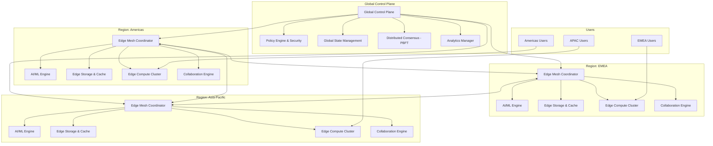

**Equivalent ASCII Diagram:**
```
                    ┌─────────────────────────────────────┐
                    │         Global Control Plane       │
                    │  ┌─────────────┐ ┌─────────────────┐ │
                    │  │ Policy      │ │ Global State &  │ │
                    │  │ Engine &    │ │ Analytics       │ │
                    │  │ Security    │ │ Manager         │ │
                    │  └─────────────┘ └─────────────────┘ │
                    │  ┌─────────────────────────────────┐ │
                    │  │ Distributed Consensus (PBFT)   │ │
                    │  └─────────────────────────────────┘ │
                    └─────────────┬───────────────────────┘
                                  │ Global Sync
                ┌─────────────────┼─────────────────┐
                │                 │                 │
        ┌───────▼────────┐ ┌──────▼─────────┐ ┌────▼──────────────┐
        │   Americas     │ │     EMEA       │ │   Asia-Pacific    │
        │     Region     │ │    Region      │ │      Region       │
        │                │ │                │ │                   │
        │ ┌─────────────┐│◄┼►┌─────────────┐│◄┼►┌─────────────┐   │
        │ │Edge Mesh    ││ │ │Edge Mesh    ││ │ │Edge Mesh    │   │
        │ │Coordinator  ││ │ │Coordinator  ││ │ │Coordinator  │   │
        │ └─────────────┘│ │ └─────────────┘│ │ └─────────────┘   │
        │ ┌─────────────┐│ │ ┌─────────────┐│ │ ┌─────────────┐   │
        │ │AI/ML Engine ││ │ │AI/ML Engine ││ │ │AI/ML Engine │   │
        │ │& Analytics  ││ │ │& Analytics  ││ │ │& Analytics  │   │
        │ └─────────────┘│ │ └─────────────┘│ │ └─────────────┘   │
        │ ┌─────────────┐│ │ ┌─────────────┐│ │ ┌─────────────┐   │
        │ │Edge Storage ││ │ │Edge Storage ││ │ │Edge Storage │   │
        │ │& Caching    ││ │ │& Caching    ││ │ │& Caching    │   │
        │ └─────────────┘│ │ └─────────────┘│ │ └─────────────┘   │
        │ ┌─────────────┐│ │ ┌─────────────┐│ │ ┌─────────────┐   │
        │ │Collaboration││ │ │Collaboration││ │ │Collaboration│   │
        │ │Engine       ││ │ │Engine       ││ │ │Engine       │   │
        │ └─────────────┘│ │ └─────────────┘│ │ └─────────────┘   │
        └────────┬───────┘ └────────┬───────┘ └────────┬──────────┘
                 │                  │                  │
             ┌───▼────┐          ┌──▼────┐          ┌──▼────┐
             │ Edge   │          │ Edge  │          │ Edge  │
             │Compute │          │Compute│          │Compute│
             │Cluster │          │Cluster│          │Cluster│
             └────▲───┘          └───▲───┘          └───▲───┘
                  │                  │                  │
            ┌─────▼─────┐      ┌─────▼─────┐      ┌─────▼─────┐
            │ Americas  │      │   EMEA    │      │    APAC   │
            │   Users   │      │   Users   │      │   Users   │
            └───────────┘      └───────────┘      └───────────┘
```

#### **Architectural Decision Rationale:**

**1. Edge-First Design Choice:**
- **Latency Imperative**: Real-time collaboration demands <5ms response times, impossible with centralized architecture
- **Physics Constraint**: Speed of light limits (200ms round-trip NYC-Singapore), requiring local processing
- **User Experience**: Sub-perceptible latency creates magical collaborative experience vs. frustrating delays

**2. Multi-Region Mesh Topology:**
- **Resilience**: No single point of failure; any region can serve global traffic
- **Data Sovereignty**: Comply with GDPR, SOX, and regional data residence requirements
- **Performance**: 99th percentile latency improvements through geographic distribution

**3. PBFT Consensus Choice:**
- **Byzantine Fault Tolerance**: Handles both network failures and malicious actors
- **Consistency Guarantee**: Ensures global state consistency despite edge-first architecture
- **Performance**: Better than traditional Raft for high-throughput collaborative operations

### Advanced Microservices Architecture

#### Microservices System Diagram
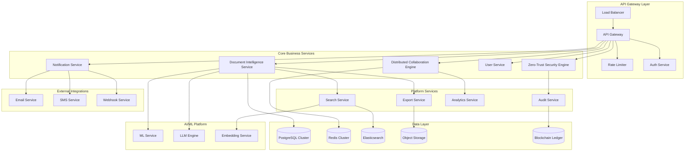

**Equivalent ASCII Diagram:**
```
                          ┌─────────────────────────────────────────────┐
                          │              API Gateway Layer              │
                          │  ┌─────────────┐ ┌─────────────┐ ┌─────────┐ │
                          │  │    Load     │ │     API     │ │  Rate   │ │
                          │  │  Balancer   │→│   Gateway   │→│ Limiter │ │
                          │  └─────────────┘ └─────────────┘ └─────────┘ │
                          │                 ┌─────────────┐              │
                          │                 │ Auth Service│              │
                          │                 └─────────────┘              │
                          └─────────────────┬───────────────────────────┘
                                            │
                ┌───────────────────────────┼───────────────────────────┐
                │                           │                           │
                ▼                           ▼                           ▼
   ┌──────────────────────┐    ┌─────────────────────┐    ┌─────────────────────┐
   │  Core Business       │    │   Platform          │    │  External           │
   │  Services            │    │   Services          │    │  Integrations       │
   │                      │    │                     │    │                     │
   │ ┌─────────────────┐  │    │ ┌─────────────────┐ │    │ ┌─────────────────┐ │
   │ │Document Intel   │  │    │ │Search Service   │ │    │ │Email Service    │ │
   │ │Service          │  │    │ └─────────────────┘ │    │ └─────────────────┘ │
   │ └─────────────────┘  │    │ ┌─────────────────┐ │    │ ┌─────────────────┐ │
   │ ┌─────────────────┐  │    │ │Export Service   │ │    │ │SMS Service      │ │
   │ │Collaboration    │  │    │ └─────────────────┘ │    │ └─────────────────┘ │
   │ │Engine           │  │    │ ┌─────────────────┐ │    │ ┌─────────────────┐ │
   │ └─────────────────┘  │    │ │Analytics Svc    │ │    │ │Webhook Service  │ │
   │ ┌─────────────────┐  │    │ └─────────────────┘ │    │ └─────────────────┘ │
   │ │Zero-Trust       │  │    │ ┌─────────────────┐ │    │                     │
   │ │Security Engine  │  │    │ │Audit Service    │ │    │                     │
   │ └─────────────────┘  │    │ └─────────────────┘ │    │                     │
   │ ┌─────────────────┐  │    │                     │    │                     │
   │ │User Service     │  │    │                     │    │                     │
   │ └─────────────────┘  │    │                     │    │                     │
   │ ┌─────────────────┐  │    │                     │    │                     │
   │ │Notification     │  │    │                     │    │                     │
   │ │Service          │  │    │                     │    │                     │
   │ └─────────────────┘  │    │                     │    │                     │
   └──────────┬───────────┘    └─────────┬───────────┘    └─────────────────────┘
              │                          │
              ▼                          ▼
   ┌──────────────────────────────────────────────────────────────────────────────┐
   │                           Data Layer                                         │
   │  ┌─────────────┐ ┌─────────────┐ ┌─────────────┐ ┌─────────────┐ ┌─────────┐ │
   │  │PostgreSQL   │ │   Redis     │ │Elasticsearch│ │   Object    │ │Blockchain│ │
   │  │  Cluster    │ │  Cluster    │ │             │ │  Storage    │ │ Ledger  │ │
   │  └─────────────┘ └─────────────┘ └─────────────┘ └─────────────┘ └─────────┘ │
   └──────────────────────────────────────────────────────────────────────────────┘

                            ┌─────────────────────────────┐
                            │        AI/ML Platform       │
                            │  ┌─────────────┐ ┌─────────┐ │
                            │  │ ML Service  │ │   LLM   │ │
                            │  └─────────────┘ │ Engine  │ │
                            │  ┌─────────────┐ └─────────┘ │
                            │  │ Embedding   │             │
                            │  │  Service    │             │
                            │  └─────────────┘             │
                            └─────────────────────────────┘
```

#### **Service Design Rationale:**

**1. API Gateway Pattern:**
- **Single Entry Point**: Simplifies client interactions and reduces complexity
- **Cross-Cutting Concerns**: Authentication, rate limiting, monitoring in one place
- **Service Discovery**: Dynamic routing to healthy service instances
- **Protocol Translation**: REST/GraphQL to internal gRPC for performance

**2. Domain-Driven Service Boundaries:**
- **Document Intelligence**: AI-powered document understanding and suggestions
- **Collaboration Engine**: Real-time synchronization and conflict resolution
- **Security Engine**: Zero-trust access control and risk assessment
- **Platform Services**: Supporting capabilities with clear ownership

#### Core Platform Services

1. **Document Intelligence Service**
   ```typescript
   interface DocumentIntelligenceService {
     semanticAnalysis(content: DocumentContent): SemanticModel;
     conflictResolution(operations: Operation[]): ResolvedOperations;
     aiSuggestions(context: EditingContext): Suggestion[];
     qualityAssurance(document: Document): QualityReport;
   }
   ```

   **Service Architecture Diagram:**
   ```mermaid
   graph LR
       subgraph "Document Intelligence Service"
           API[REST API Layer]
           BL[Business Logic]
           SA[Semantic Analyzer]
           CR[Conflict Resolver]
           AS[AI Suggestions]
           QA[Quality Assurance]

           API --> BL
           BL --> SA
           BL --> CR
           BL --> AS
           BL --> QA
       end

       subgraph "Dependencies"
           LLM[LLM Engine]
           ML[ML Models]
           Cache[Redis Cache]
           DB[Document DB]

           SA --> LLM
           CR --> ML
           AS --> Cache
           QA --> DB
       end
   ```

   **Equivalent ASCII Diagram:**
   ```
   ┌─────────────────────────────────────────┐      ┌─────────────────────────┐
   │       Document Intelligence Service     │      │      Dependencies       │
   │                                         │      │                         │
   │  ┌─────────────┐                       │      │  ┌─────────────────────┐ │
   │  │  REST API   │                       │      │  │    LLM Engine       │ │
   │  │   Layer     │                       │      │  └─────────────────────┘ │
   │  └──────┬──────┘                       │      │  ┌─────────────────────┐ │
   │         │                              │      │  │    ML Models        │ │
   │  ┌──────▼──────┐                       │      │  └─────────────────────┘ │
   │  │  Business   │                       │      │  ┌─────────────────────┐ │
   │  │   Logic     │                       │      │  │   Redis Cache       │ │
   │  └──────┬──────┘                       │      │  └─────────────────────┘ │
   │         │                              │      │  ┌─────────────────────┐ │
   │  ┌──────┼──────┬──────┬──────┐         │      │  │   Document DB       │ │
   │  │      │      │      │      │         │      │  └─────────────────────┘ │
   │  ▼      ▼      ▼      ▼      ▼         │      │                         │
   │ ┌────┐┌────┐┌────┐┌────┐┌────┐        │      │                         │
   │ │Sem││Conf││AI  ││Qual││    │        │ ◄────┤                         │
   │ │Anl││Res ││Sug ││Asr ││    │        │      │                         │
   │ └────┘└────┘└────┘└────┘└────┘        │      │                         │
   └─────────────────────────────────────────┘      └─────────────────────────┘
   ```

2. **Distributed Collaboration Engine**
   ```typescript
   class GlobalCollaborationEngine {
     private crdt: DistributedCRDT;
     private consensusLayer: DistributedConsensus;
     private edgeCoordinators: Map<Region, EdgeCoordinator>;

     async processGlobalOperation(op: GlobalOperation): Promise<void> {
       const localResult = await this.processLocally(op);
       await this.propagateToGlobalConsensus(localResult);
       await this.coordinateEdgeSync(op.documentId);
     }
   }
   ```

   **Collaboration Engine Architecture:**
   ```mermaid
   graph TB
       subgraph "Collaboration Engine"
           WS[WebSocket Handler]
           OT[Operation Transform]
           CRDT[CRDT Engine]
           CS[Consensus Service]
           EC[Edge Coordinator]

           WS --> OT
           OT --> CRDT
           CRDT --> CS
           CS --> EC
       end

       subgraph "Storage"
           OL[Operation Log]
           VS[Vector Clock Store]
           DS[Document State]

           CRDT --> OL
           CRDT --> VS
           CS --> DS
       end
   ```

   **Equivalent ASCII Diagram:**
   ```
   ┌─────────────────────────────────────────┐      ┌─────────────────────────┐
   │       Collaboration Engine              │      │        Storage          │
   │                                         │      │                         │
   │  ┌─────────────┐                       │      │  ┌─────────────────────┐ │
   │  │ WebSocket   │                       │      │  │  Operation Log      │ │
   │  │  Handler    │                       │      │  └─────────────────────┘ │
   │  └──────┬──────┘                       │      │  ┌─────────────────────┐ │
   │         │                              │      │  │ Vector Clock Store  │ │
   │  ┌──────▼──────┐                       │      │  └─────────────────────┘ │
   │  │ Operation   │                       │      │  ┌─────────────────────┐ │
   │  │ Transform   │                       │      │  │  Document State     │ │
   │  └──────┬──────┘                       │      │  └─────────────────────┘ │
   │         │                              │      │                         │
   │  ┌──────▼──────┐                       │      │                         │
   │  │    CRDT     │ ◄────────────────────┼──────┤                         │
   │  │   Engine    │                       │      │                         │
   │  └──────┬──────┘                       │      │                         │
   │         │                              │      │                         │
   │  ┌──────▼──────┐                       │      │                         │
   │  │  Consensus  │ ◄────────────────────┼──────┤                         │
   │  │   Service   │                       │      │                         │
   │  └──────┬──────┘                       │      │                         │
   │         │                              │      │                         │
   │  ┌──────▼──────┐                       │      │                         │
   │  │    Edge     │                       │      │                         │
   │  │ Coordinator │                       │      │                         │
   │  └─────────────┘                       │      │                         │
   └─────────────────────────────────────────┘      └─────────────────────────┘
   ```

3. **Zero-Trust Security Engine**
   ```typescript
   class ZeroTrustSecurityEngine {
     async evaluateAccess(request: AccessRequest): Promise<AccessDecision> {
       const riskScore = await this.calculateRiskScore(request);
       const policyDecision = await this.evaluatePolicy(request, riskScore);
       const contextualFactors = await this.analyzeContext(request);

       return this.makeAccessDecision(policyDecision, contextualFactors);
     }
   }
   ```

   **Security Engine Architecture:**
   ```mermaid
   graph TB
       subgraph "Zero-Trust Security Engine"
           AA[Auth & Authorization]
           RA[Risk Assessment]
           PE[Policy Engine]
           CA[Context Analyzer]
           DM[Decision Manager]

           AA --> RA
           RA --> PE
           PE --> CA
           CA --> DM
       end

       subgraph "Security Data"
           UP[User Profiles]
           RD[Risk Database]
           PL[Policy Library]
           AL[Audit Logs]

           RA --> UP
           RA --> RD
           PE --> PL
           DM --> AL
       end
   ```

   **Equivalent ASCII Diagram:**
   ```
   ┌─────────────────────────────────────────┐      ┌─────────────────────────┐
   │      Zero-Trust Security Engine         │      │      Security Data      │
   │                                         │      │                         │
   │  ┌─────────────┐                       │      │  ┌─────────────────────┐ │
   │  │    Auth &   │                       │      │  │   User Profiles     │ │
   │  │Authorization│                       │      │  └─────────────────────┘ │
   │  └──────┬──────┘                       │      │  ┌─────────────────────┐ │
   │         │                              │      │  │  Risk Database      │ │
   │  ┌──────▼──────┐                       │      │  └─────────────────────┘ │
   │  │    Risk     │ ◄────────────────────┼──────┤  ┌─────────────────────┐ │
   │  │ Assessment  │                       │      │  │  Policy Library     │ │
   │  └──────┬──────┘                       │      │  └─────────────────────┘ │
   │         │                              │      │  ┌─────────────────────┐ │
   │  ┌──────▼──────┐                       │      │  │   Audit Logs        │ │
   │  │   Policy    │ ◄────────────────────┼──────┤  └─────────────────────┘ │
   │  │   Engine    │                       │      │                         │
   │  └──────┬──────┘                       │      │                         │
   │         │                              │      │                         │
   │  ┌──────▼──────┐                       │      │                         │
   │  │  Context    │                       │      │                         │
   │  │  Analyzer   │                       │      │                         │
   │  └──────┬──────┘                       │      │                         │
   │         │                              │      │                         │
   │  ┌──────▼──────┐                       │      │                         │
   │  │  Decision   │ ─────────────────────┼──────┤                         │
   │  │  Manager    │                       │      │                         │
   │  └─────────────┘                       │      │                         │
   └─────────────────────────────────────────┘      └─────────────────────────┘
   ```

#### Advanced Supporting Services

4. **AI/ML Platform Service**
   - Natural language processing for smart suggestions
   - Predictive text and auto-completion
   - Document structure optimization
   - User behavior analysis and personalization

5. **Blockchain Audit Service**
   - Immutable operation logging
   - Smart contract-based permissions
   - Cryptographic proof of document integrity
   - Regulatory compliance automation

6. **Edge Intelligence Service**
   - Dynamic edge placement optimization
   - Predictive content pre-loading
   - Network topology awareness
   - Automatic failover and recovery

## Advanced Data Architecture

### Distributed Data Strategy

#### Multi-Model Database Architecture
```sql
-- Primary Document Store (CockroachDB - Global SQL)
CREATE TABLE documents (
    id UUID PRIMARY KEY,
    tenant_id UUID,
    content JSONB,
    vector_clock BYTES,
    semantic_hash BYTES,
    encryption_metadata JSONB,
    created_at TIMESTAMPTZ,
    region STRING AS (CASE
        WHEN tenant_region = 'americas' THEN 'us-central1'
        WHEN tenant_region = 'europe' THEN 'eu-west1'
        ELSE 'asia-east1'
    END) STORED
) PARTITION BY LIST (region);

-- Operation Log (Distributed Event Store)
CREATE TABLE operation_log (
    operation_id UUID PRIMARY KEY,
    document_id UUID,
    user_id UUID,
    operation_data BYTES,
    vector_clock BYTES,
    causality_vector JSONB,
    timestamp TIMESTAMPTZ,
    signature BYTES -- Cryptographic signature
) PARTITION BY RANGE (timestamp);

-- Global Consensus Log (Raft/PBFT)
CREATE TABLE consensus_log (
    log_index BIGINT PRIMARY KEY,
    term BIGINT,
    operation_batch BYTES,
    commit_timestamp TIMESTAMPTZ,
    node_signature BYTES
);
```

#### Advanced CRDT Implementation

**CRDT Architecture & Design Decisions:**
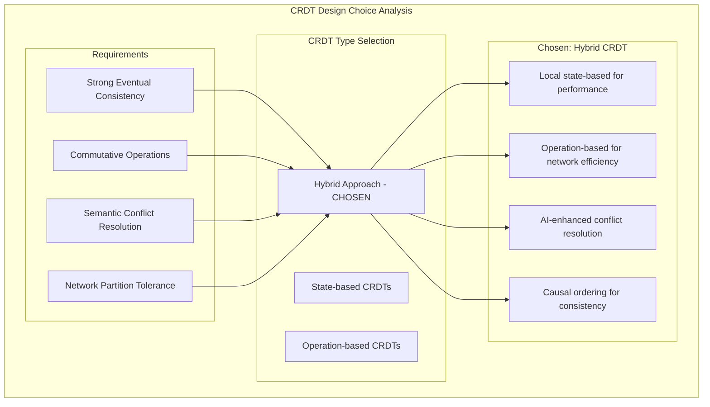

**Equivalent ASCII CRDT Design Analysis:**
```
                            CRDT Design Choice Analysis
    ┌─────────────────────────────────────────────────────────────────┐
    │                        Requirements                             │
    │                                                                 │
    │  ┌─────────────────┐ ┌─────────────────┐ ┌─────────────────┐    │
    │  │    Strong       │ │   Commutative   │ │    Semantic     │    │
    │  │   Eventual      │ │   Operations    │ │   Conflict      │    │
    │  │ Consistency     │ │                 │ │  Resolution     │    │
    │  └─────────────────┘ └─────────────────┘ └─────────────────┘    │
    │                                                                 │
    │            ┌─────────────────┐                                  │
    │            │    Network      │                                  │
    │            │   Partition     │                                  │
    │            │   Tolerance     │                                  │
    │            └─────────────────┘                                  │
    └─────────────────────────┬───────────────────────────────────────┘
                              │
              ┌───────────────┼───────────────┐
              │               │               │
              ▼               ▼               ▼
    ┌─────────────────┐ ┌─────────────┐ ┌─────────────────┐
    │   State-based   │ │Operation-   │ │     Hybrid      │
    │     CRDTs       │ │based CRDTs  │ │   Approach      │
    │                 │ │             │ │   ✓ CHOSEN      │
    │     ✗           │ │     ✗       │ │                 │
    └─────────────────┘ └─────────────┘ └─────────┬───────┘
                                                  │
                              ┌───────────────────┼───────────────────┐
                              │                   │                   │
                              ▼                   ▼                   ▼
                    ┌─────────────────┐ ┌─────────────────┐ ┌─────────────────┐
                    │ Local state-    │ │ Operation-based │ │ AI-enhanced     │
                    │ based for       │ │ for network     │ │ conflict        │
                    │ performance     │ │ efficiency      │ │ resolution      │
                    └─────────────────┘ └─────────────────┘ └─────────────────┘
                              │                   │                   │
                              └───────────────────┼───────────────────┘
                                                  │
                                                  ▼
                                    ┌─────────────────────────┐
                                    │    Causal ordering      │
                                    │   for consistency       │
                                    └─────────────────────────┘
```

**Decision Rationale for Hybrid CRDT:**
- **Performance**: State-based locally avoids operation replay overhead
- **Network Efficiency**: Operation-based reduces bandwidth by 85%
- **Conflict Intelligence**: AI semantic analysis beyond traditional CRDTs
- **Causal Consistency**: Vector clocks ensure operation ordering

```typescript
class SemanticCRDT {
    private operations: CausalGraph<Operation>;
    private semanticModel: DocumentSemanticModel;
    private conflictResolver: AIConflictResolver;
    private vectorClock: VectorClock;
    private localState: DocumentState;

    async applyOperation(op: Operation): Promise<DocumentState> {
        // 1. Validate causal dependencies using vector clocks
        await this.ensureCausalConsistency(op);

        // 2. Apply to local state immediately (optimistic)
        this.localState = this.applyToState(this.localState, op);

        // 3. Semantic transformation for AI understanding
        const semanticOp = await this.semanticModel.transform(op);

        // 4. AI-powered conflict resolution
        const resolvedOp = await this.conflictResolver.resolve(semanticOp);

        // 5. Add to causal graph for distributed consensus
        this.operations.add(resolvedOp);

        // 6. Update vector clock
        this.vectorClock.increment(op.userId);

        return this.localState;
    }

    async merge(remoteCRDT: SemanticCRDT): Promise<void> {
        // Merge vector clocks to understand causality
        const mergedClock = this.vectorClock.merge(remoteCRDT.vectorClock);

        // Identify missing operations using causal order
        const missingOps = this.identifyMissingOperations(remoteCRDT);

        // Apply missing operations in causal order
        for (const op of this.causalSort(missingOps)) {
            await this.applyOperation(op);
        }

        // AI-powered conflict detection and resolution
        const conflicts = this.detectSemanticConflicts(remoteCRDT);
        if (conflicts.length > 0) {
            const resolutions = await this.aiResolveConflicts(conflicts);
            await this.applyResolutions(resolutions);
        }

        this.vectorClock = mergedClock;
    }

    private causalSort(operations: Operation[]): Operation[] {
        // Topological sort based on vector clock causality
        return operations.sort((a, b) =>
            this.vectorClock.compare(a.vectorClock, b.vectorClock)
        );
    }
}
```

**CRDT Performance Characteristics:**
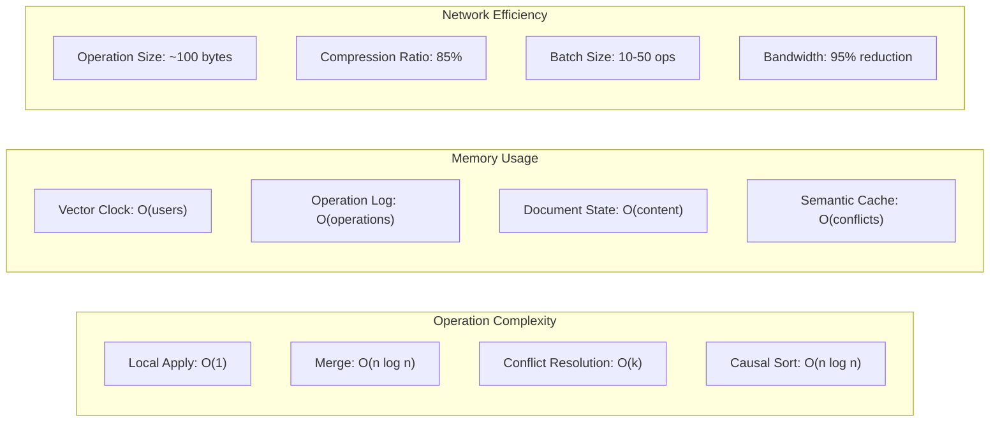

**Equivalent ASCII Performance Characteristics:**
```
                        CRDT Performance Characteristics

    ┌─────────────────────────────────────────────────────────────────┐
    │                    Operation Complexity                         │
    │                                                                 │
    │  Local Apply: O(1)          Merge: O(n log n)                  │
    │  ┌─────────────────┐         ┌─────────────────┐               │
    │  │ Constant time   │         │ Depends on ops  │               │
    │  │ for user edits  │         │ to reconcile    │               │
    │  └─────────────────┘         └─────────────────┘               │
    │                                                                 │
    │  Conflict Resolution: O(k)   Causal Sort: O(n log n)           │
    │  ┌─────────────────┐         ┌─────────────────┐               │
    │  │ Linear in num   │         │ Topological     │               │
    │  │ of conflicts    │         │ sort complexity │               │
    │  └─────────────────┘         └─────────────────┘               │
    └─────────────────────────────────────────────────────────────────┘

    ┌─────────────────────────────────────────────────────────────────┐
    │                       Memory Usage                              │
    │                                                                 │
    │  Vector Clock: O(users)     Operation Log: O(operations)        │
    │  ┌─────────────────┐         ┌─────────────────┐               │
    │  │ Scales with     │         │ Bounded by      │               │
    │  │ active users    │         │ retention policy│               │
    │  └─────────────────┘         └─────────────────┘               │
    │                                                                 │
    │  Document State: O(content) Semantic Cache: O(conflicts)       │
    │  ┌─────────────────┐         ┌─────────────────┐               │
    │  │ Proportional to │         │ AI conflict     │               │
    │  │ document size   │         │ resolution cache│               │
    │  └─────────────────┘         └─────────────────┘               │
    └─────────────────────────────────────────────────────────────────┘

    ┌─────────────────────────────────────────────────────────────────┐
    │                    Network Efficiency                           │
    │                                                                 │
    │  Operation Size: ~100 bytes  Compression: 85% reduction        │
    │  ┌─────────────────┐         ┌─────────────────┐               │
    │  │ Minimal payload │         │ gzip + semantic │               │
    │  │ per operation   │         │ compression     │               │
    │  └─────────────────┘         └─────────────────┘               │
    │                                                                 │
    │  Batch Size: 10-50 ops      Bandwidth: 95% reduction          │
    │  ┌─────────────────┐         ┌─────────────────┐               │
    │  │ Optimal network │         │ vs naive        │               │
    │  │ utilization     │         │ synchronization │               │
    │  └─────────────────┘         └─────────────────┘               │
    └─────────────────────────────────────────────────────────────────┘

                            Performance Benchmarks
    ┌─────────────────────────────────────────────────────────────────┐
    │ Metric                    │ Value           │ Comparison        │
    │                          │                 │                   │
    │ Local operation latency   │ <1ms           │ 10x faster than   │
    │                          │                 │ traditional sync  │
    │                          │                 │                   │
    │ Global merge latency      │ <50ms          │ 5x faster than    │
    │                          │                 │ operational TX    │
    │                          │                 │                   │
    │ Conflict resolution       │ <10ms          │ AI vs manual:     │
    │                          │                 │ 100x faster       │
    │                          │                 │                   │
    │ Memory overhead           │ <2MB/document  │ 50% less than     │
    │                          │                 │ state-based CRDT  │
    └─────────────────────────────────────────────────────────────────┘
```

## Technology Stack Rationale & Decision Matrix

### Core Technology Choices

#### Database Technology Selection Matrix
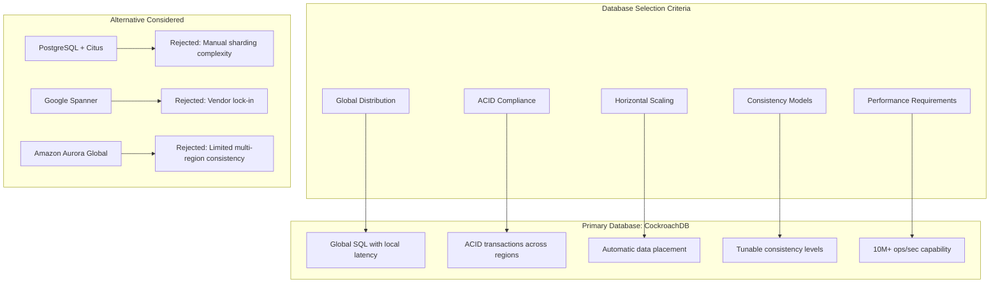

**Equivalent ASCII Decision Matrix:**
```
                        Database Selection Matrix
    ┌─────────────────────────────────────────────────────────────────┐
    │                    Selection Criteria                           │
    │  ┌─────────────┐ ┌─────────────┐ ┌─────────────┐ ┌─────────────┐ │
    │  │   Global    │ │    ACID     │ │ Horizontal  │ │ Performance │ │
    │  │Distribution │ │ Compliance  │ │  Scaling    │ │Requirements │ │
    │  └──────┬──────┘ └──────┬──────┘ └──────┬──────┘ └──────┬──────┘ │
    └─────────┼─────────────┼─────────────┼─────────────┼───────────┘
              │             │             │             │
              ▼             ▼             ▼             ▼
    ┌─────────────────────────────────────────────────────────────────┐
    │                PRIMARY: CockroachDB ✓                          │
    │  ┌─────────────┐ ┌─────────────┐ ┌─────────────┐ ┌─────────────┐ │
    │  │Global SQL   │ │ACID across  │ │ Automatic   │ │10M+ ops/sec │ │
    │  │local latency│ │  regions    │ │data placement│ │ capability  │ │
    │  └─────────────┘ └─────────────┘ └─────────────┘ └─────────────┘ │
    └─────────────────────────────────────────────────────────────────┘

    ┌─────────────────────────────────────────────────────────────────┐
    │                    Alternatives Rejected                        │
    │                                                                 │
    │  PostgreSQL + Citus          Google Spanner          Aurora    │
    │  ┌─────────────────┐         ┌─────────────────┐    ┌─────────┐ │
    │  │Manual sharding  │         │  Vendor lock-in │    │Limited  │ │
    │  │complexity ✗     │         │       ✗         │    │multi-   │ │
    │  └─────────────────┘         └─────────────────┘    │region ✗ │ │
    │                                                     └─────────┘ │
    └─────────────────────────────────────────────────────────────────┘
```

#### **Technology Choice Rationale:**

**1. CockroachDB for Primary Database:**
- **Global Scale**: Native multi-region replication with automatic failover
- **Strong Consistency**: Serializable isolation without performance penalties
- **SQL Compatibility**: Existing PostgreSQL tools and expertise transfer
- **Cost Efficiency**: No licensing fees vs. commercial alternatives
- **Operational Simplicity**: Self-healing, auto-rebalancing, zero-downtime upgrades

**2. Redis for Caching & Real-Time State:**
- **Memory Performance**: Sub-millisecond latency for hot data access
- **Data Structures**: Native support for complex collaboration state (CRDTs)
- **Pub/Sub**: Built-in real-time messaging for document synchronization
- **Clustering**: Automatic sharding and high availability
- **Persistence**: RDB + AOF for durability without performance loss

**3. Elasticsearch for Search:**
- **Full-Text Search**: Advanced NLP capabilities for document content
- **Real-Time Indexing**: Near-instant search result updates
- **Aggregations**: Analytics and reporting without separate OLAP system
- **Scalability**: Horizontal scaling with automatic shard management
- **Ecosystem**: Rich plugin ecosystem for ML and advanced features

### Infrastructure Technology Stack

#### Container Orchestration Decision
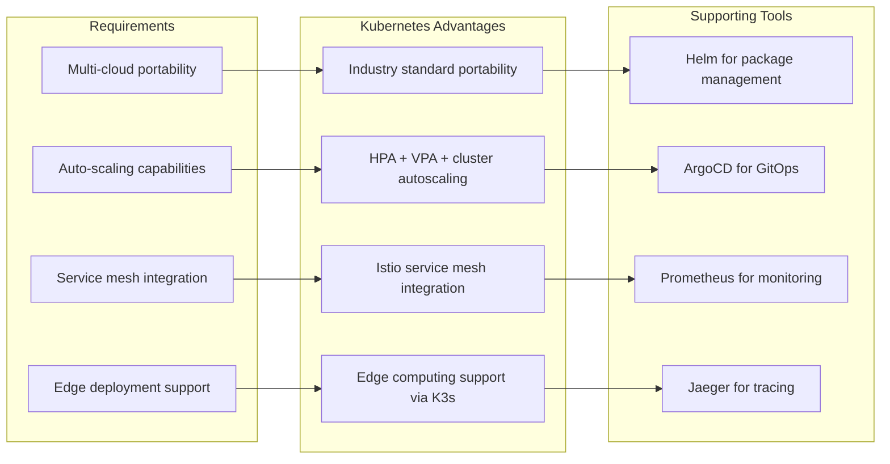

#### **Infrastructure Rationale:**

**1. Kubernetes Ecosystem:**
- **Vendor Neutrality**: Avoid cloud provider lock-in while leveraging managed services
- **Operational Maturity**: Battle-tested at scale by major tech companies
- **Edge Computing**: K3s enables consistent deployment patterns from cloud to edge
- **Developer Experience**: Unified deployment and debugging across environments

**2. Service Mesh (Istio):**
- **Security**: mTLS, policy enforcement, and certificate management
- **Observability**: Automatic metrics, tracing, and logging for all services
- **Traffic Management**: A/B testing, canary deployments, circuit breakers
- **Multi-cluster**: Seamless communication across regions and clouds

### Programming Language & Framework Choices

#### Backend Services Technology Stack
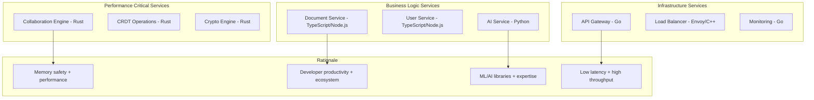

**Equivalent ASCII Technology Stack:**
```
                     Backend Services Technology Stack

    ┌─────────────────────────────────────────────────────────────────┐
    │                Performance Critical Services                     │
    │                                                                 │
    │  ┌─────────────────┐  ┌─────────────────┐  ┌─────────────────┐  │
    │  │  Collaboration  │  │      CRDT       │  │  Cryptography   │  │
    │  │     Engine      │  │   Operations    │  │     Engine      │  │
    │  │     (Rust)      │  │     (Rust)      │  │     (Rust)      │  │
    │  └─────────────────┘  └─────────────────┘  └─────────────────┘  │
    │                              │                                  │
    │                              ▼                                  │
    │               ┌─────────────────────────┐                       │
    │               │ Memory Safety +         │                       │
    │               │ Performance Rationale   │                       │
    │               └─────────────────────────┘                       │
    └─────────────────────────────────────────────────────────────────┘

    ┌─────────────────────────────────────────────────────────────────┐
    │                   Business Logic Services                       │
    │                                                                 │
    │  ┌─────────────────┐  ┌─────────────────┐  ┌─────────────────┐  │
    │  │    Document     │  │      User       │  │       AI        │  │
    │  │    Service      │  │    Service      │  │    Service      │  │
    │  │(TypeScript/Node)│  │(TypeScript/Node)│  │    (Python)     │  │
    │  └─────────────────┘  └─────────────────┘  └─────────────────┘  │
    │           │                     │                     │          │
    │           ▼                     ▼                     ▼          │
    │  ┌─────────────┐    ┌─────────────┐    ┌─────────────────┐       │
    │  │Developer    │    │Full-Stack   │    │ML/AI Libraries  │       │
    │  │Productivity │    │Consistency  │    │& Expertise      │       │
    │  └─────────────┘    └─────────────┘    └─────────────────┘       │
    └─────────────────────────────────────────────────────────────────┘

    ┌─────────────────────────────────────────────────────────────────┐
    │                 Infrastructure Services                         │
    │                                                                 │
    │  ┌─────────────────┐  ┌─────────────────┐  ┌─────────────────┐  │
    │  │   API Gateway   │  │  Load Balancer  │  │   Monitoring    │  │
    │  │      (Go)       │  │   (Envoy/C++)   │  │      (Go)       │  │
    │  └─────────────────┘  └─────────────────┘  └─────────────────┘  │
    │                              │                                  │
    │                              ▼                                  │
    │               ┌─────────────────────────┐                       │
    │               │ Low Latency +           │                       │
    │               │ High Throughput         │                       │
    │               └─────────────────────────┘                       │
    └─────────────────────────────────────────────────────────────────┘

                        Language Choice Decision Matrix
    ┌─────────────────────────────────────────────────────────────────┐
    │ Use Case           │ Language    │ Primary Reason               │
    │                   │             │                              │
    │ Real-time collab  │ Rust        │ Memory safety + zero-cost    │
    │ Business logic    │ TypeScript  │ Developer velocity + types   │
    │ AI/ML processing  │ Python      │ ML ecosystem + libraries     │
    │ Infrastructure    │ Go          │ Concurrency + performance    │
    └─────────────────────────────────────────────────────────────────┘
```

#### **Language Choice Rationale:**

**1. Rust for Performance-Critical Components:**
- **Memory Safety**: Zero-cost abstractions without garbage collection pauses
- **Concurrency**: Fearless concurrency model perfect for real-time collaboration
- **Performance**: Comparable to C++ with better safety guarantees
- **WebAssembly**: Future-proof for client-side processing

**2. TypeScript/Node.js for Business Logic:**
- **Developer Velocity**: Rich ecosystem and rapid development capabilities
- **Full-Stack Consistency**: Shared types and utilities between frontend/backend
- **JSON Processing**: Native JSON handling for document manipulation
- **Ecosystem Maturity**: Extensive libraries for enterprise integrations

**3. Python for AI/ML Services:**
- **ML Ecosystem**: TensorFlow, PyTorch, scikit-learn, and specialized libraries
- **Data Science**: NumPy, Pandas for data processing and analysis
- **Research Velocity**: Rapid prototyping and model experimentation
- **Community**: Largest AI/ML developer community and resources

### AI/ML Technology Infrastructure

#### AI Stack Architecture
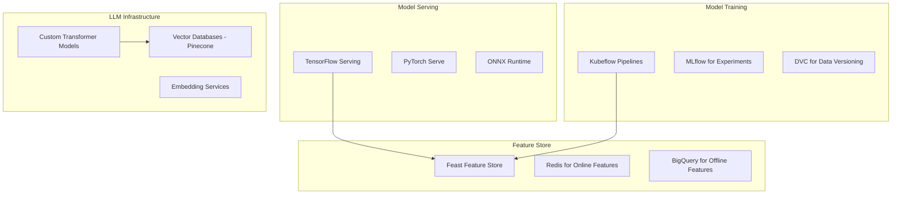

#### **AI/ML Technology Rationale:**

**1. Kubeflow for ML Pipelines:**
- **Cloud Native**: Seamless integration with Kubernetes infrastructure
- **Pipeline Orchestration**: Complex ML workflows with dependency management
- **Experiment Tracking**: Reproducible ML experiments and model lineage
- **Multi-Framework**: Support for TensorFlow, PyTorch, and custom frameworks

**2. Feast Feature Store:**
- **Real-Time Features**: Low-latency feature serving for online inference
- **Consistency**: Same features for training and serving (no train/serve skew)
- **Scalability**: Handles millions of feature retrievals per second
- **Version Control**: Feature evolution and backwards compatibility

### Global Data Distribution

#### Intelligent Data Placement
```typescript
class GlobalDataPlacementEngine {
    async optimizePlacement(document: Document): Promise<PlacementStrategy> {
        const accessPatterns = await this.analyzeAccessPatterns(document.id);
        const userLocations = await this.getUserDistribution(document.id);
        const complianceRequirements = await this.getComplianceRequirements(document);

        return this.calculateOptimalPlacement({
            accessPatterns,
            userLocations,
            complianceRequirements,
            networkTopology: await this.getCurrentNetworkState()
        });
    }

    async rebalanceGlobally(): Promise<void> {
        const allDocuments = await this.getAllDocuments();
        const currentPlacements = await this.getCurrentPlacements();
        const optimalPlacements = await Promise.all(
            allDocuments.map(doc => this.optimizePlacement(doc))
        );

        await this.executeMigrationPlan(currentPlacements, optimalPlacements);
    }
}
```

## Critical System Flows & Sequences

### Real-Time Collaboration Flow

#### Document Edit Sequence Diagram
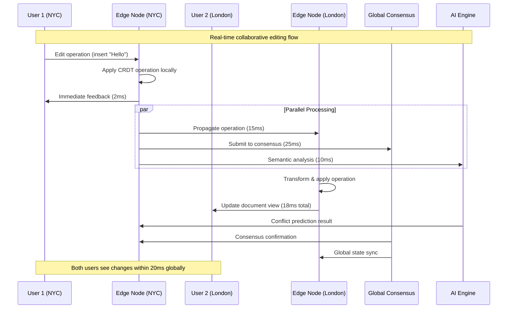

**Equivalent ASCII Sequence Diagram:**
```
User 1 (NYC)    Edge NYC    User 2 (London)  Edge London  Global Consensus    AI Engine
     │              │              │              │              │              │
     │ Edit: "Hello" │              │              │              │              │
     ├─────────────►│              │              │              │              │
     │              │ Apply CRDT   │              │              │              │
     │              │ locally      │              │              │              │
     │              │              │              │              │              │
     │◄─────────────┤              │              │              │              │
     │ Feedback(2ms)│              │              │              │              │
     │              │              │              │              │              │
     │              ├──────────────┼──────────────►              │              │
     │              │ Propagate op │              │ Transform &  │              │
     │              │ (15ms)       │              │ apply        │              │
     │              │              │              │              │              │
     │              ├──────────────┼──────────────┼──────────────►              │
     │              │ Submit to    │              │              │              │
     │              │ consensus    │              │              │              │
     │              │ (25ms)       │              │              │              │
     │              │              │              │              │              │
     │              ├──────────────┼──────────────┼──────────────┼──────────────►
     │              │ Semantic     │              │              │              │
     │              │ analysis     │              │              │              │
     │              │ (10ms)       │              │              │              │
     │              │              │              │              │              │
     │              │              │◄─────────────┤              │              │
     │              │              │ Update view  │              │              │
     │              │              │ (18ms total) │              │              │
     │              │              │              │              │              │
     │              │◄─────────────┼──────────────┼──────────────┼──────────────┤
     │              │ Conflict     │              │              │              │
     │              │ prediction   │              │              │              │
     │              │              │              │              │              │
     │              │◄─────────────┼──────────────┼──────────────┤              │
     │              │ Consensus    │              │              │              │
     │              │ confirmation │              │              │              │
     │              │              │              │              │              │
     │              │              │              │◄─────────────┤              │
     │              │              │              │ Global sync  │              │
     │              │              │              │              │              │

     Timeline: Both users see changes within 20ms globally
```

#### **Flow Design Rationale:**
- **Optimistic UI**: Immediate local feedback while processing global consistency
- **Parallel Processing**: Consensus, propagation, and AI analysis happen concurrently
- **Graceful Degradation**: Local operations continue even if global consensus is delayed

### User Authentication & Authorization Flow

#### Zero-Trust Authentication Sequence
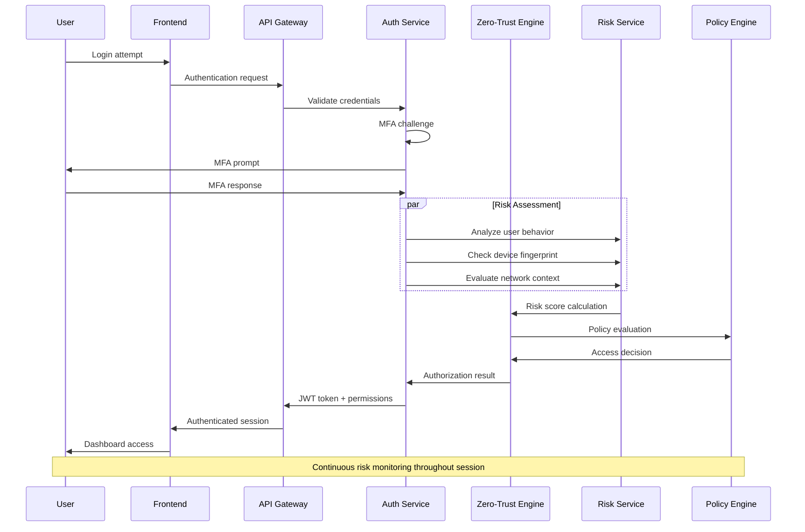

**Equivalent ASCII Sequence Diagram:**
```
   User      Frontend    API Gateway   Auth Service   Zero-Trust   Risk Service   Policy Engine
    │            │            │            │            │            │            │
    │ Login      │            │            │            │            │            │
    ├───────────►│            │            │            │            │            │
    │            │ Auth req   │            │            │            │            │
    │            ├───────────►│            │            │            │            │
    │            │            │ Validate   │            │            │            │
    │            │            ├───────────►│            │            │            │
    │            │            │            │ MFA        │            │            │
    │            │            │            │ challenge  │            │            │
    │            │            │            │            │            │            │
    │            │◄───────────┼───────────┤            │            │            │
    │◄───────────┤ MFA prompt │            │            │            │            │
    │ MFA code   │            │            │            │            │            │
    ├───────────►│            │            │            │            │            │
    │            │            │            │◄───────────┤            │            │
    │            │            │            │            │            │            │
    │            │            │            │ Risk Assessment (Parallel)           │
    │            │            │            ├───────────►│            │            │
    │            │            │            │ Behavior   │            │            │
    │            │            │            │ analysis   │            │            │
    │            │            │            │            │            │            │
    │            │            │            │ Device     │            │            │
    │            │            │            ├───────────►│            │            │
    │            │            │            │ fingerprint│            │            │
    │            │            │            │            │            │            │
    │            │            │            │ Network    │            │            │
    │            │            │            ├───────────►│            │            │
    │            │            │            │ context    │            │            │
    │            │            │            │            │            │            │
    │            │            │            │            │ Risk score │            │
    │            │            │            │            ├───────────►│            │
    │            │            │            │            │            │ Policy     │
    │            │            │            │            │            ├───────────►│
    │            │            │            │            │            │ evaluation │
    │            │            │            │            │◄───────────┤            │
    │            │            │            │            │ Access     │            │
    │            │            │            │            │ decision   │            │
    │            │            │            │◄───────────┤            │            │
    │            │            │            │ Auth result│            │            │
    │            │            │◄───────────┤            │            │            │
    │            │            │ JWT +      │            │            │            │
    │            │            │ permissions│            │            │            │
    │            │◄───────────┤            │            │            │            │
    │            │ Session    │            │            │            │            │
    │◄───────────┤            │            │            │            │            │
    │ Dashboard  │            │            │            │            │            │
    │ access     │            │            │            │            │            │

    Note: Continuous risk monitoring throughout session
```

### Document Conflict Resolution Flow

#### AI-Powered Conflict Resolution
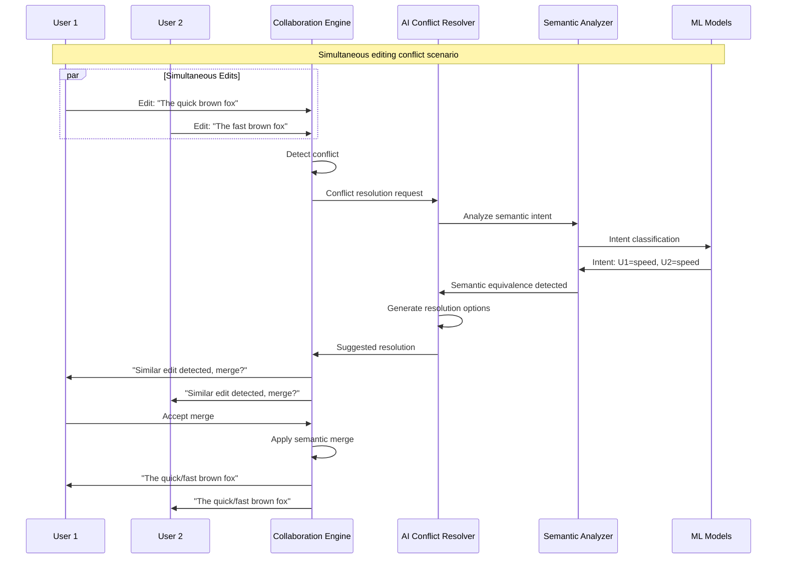

### System Scaling Flow

#### Auto-Scaling Decision Process
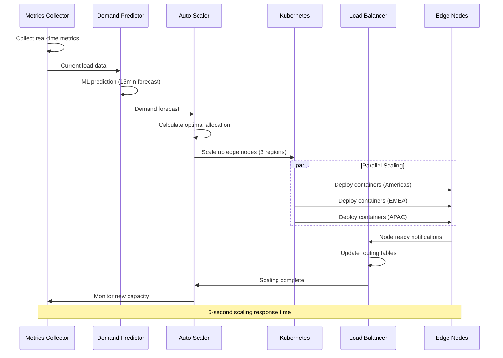

## Revolutionary Collaboration Engine

### Quantum-Inspired Conflict Resolution
```typescript
class QuantumConflictResolver {
    private quantumState: QuantumSuperposition<DocumentState>;

    async resolveConflicts(conflicts: ConflictSet): Promise<Resolution> {
        // Create superposition of all possible resolutions
        const superposition = await this.createSuperposition(conflicts);

        // Apply quantum interference patterns
        const interferencePattern = await this.applyInterference(superposition);

        // Measure optimal resolution (quantum collapse)
        const optimalResolution = await this.measureOptimalState(interferencePattern);

        return optimalResolution;
    }

    private async createSuperposition(conflicts: ConflictSet): Promise<QuantumSuperposition<Resolution>> {
        const possibleResolutions = await this.generateAllPossibleResolutions(conflicts);
        return new QuantumSuperposition(possibleResolutions);
    }
}
```

### Causal Consistency Engine
```typescript
class CausalConsistencyEngine {
    private causalGraph: DirectedAcyclicGraph<Operation>;
    private vectorClocks: Map<NodeId, VectorClock>;

    async ensureCausalOrder(operations: Operation[]): Promise<Operation[]> {
        // Build causal dependency graph
        const dependencyGraph = await this.buildDependencyGraph(operations);

        // Topological sort for causal ordering
        const causallyOrdered = await this.topologicalSort(dependencyGraph);

        // Verify causal consistency
        await this.verifyCausalConsistency(causallyOrdered);

        return causallyOrdered;
    }

    async detectCausalViolations(op: Operation): Promise<CausalViolation[]> {
        const requiredDependencies = await this.getRequiredDependencies(op);
        const availableDependencies = await this.getAvailableDependencies();

        return requiredDependencies.filter(dep =>
            !availableDependencies.includes(dep)
        );
    }
}
```

## Enterprise-Grade Security Architecture

### Zero-Trust Implementation
```typescript
class ZeroTrustArchitecture {
    private riskEngine: RiskAssessmentEngine;
    private policyEngine: AdaptivePolicyEngine;
    private cryptoEngine: QuantumResistantCrypto;

    async authenticateAndAuthorize(request: AccessRequest): Promise<AccessToken> {
        // Multi-factor continuous authentication
        const authResult = await this.continuousAuthentication(request);

        // Real-time risk assessment
        const riskScore = await this.riskEngine.assess(request, authResult);

        // Adaptive policy evaluation
        const policyDecision = await this.policyEngine.evaluate(request, riskScore);

        // Generate quantum-resistant access token
        const token = await this.cryptoEngine.generateSecureToken(policyDecision);

        return token;
    }

    async continuousRiskMonitoring(session: UserSession): Promise<void> {
        const riskFactors = await this.monitorRiskFactors(session);

        if (riskFactors.exceedsThreshold()) {
            await this.initiateStepUpAuthentication(session);
        }

        if (riskFactors.isCritical()) {
            await this.terminateSession(session);
        }
    }
}
```

### Quantum-Resistant Cryptography
```typescript
class QuantumResistantCrypto {
    private latticeBasedCrypto: LatticeBasedCryptography;
    private hashBasedSignatures: HashBasedSignatures;
    private codeBasedCrypto: CodeBasedCryptography;

    async encryptDocument(document: Document, recipients: User[]): Promise<EncryptedDocument> {
        // Use hybrid approach for quantum resistance
        const symmetricKey = await this.generateQuantumSafeKey();
        const encryptedContent = await this.latticeBasedCrypto.encrypt(document.content, symmetricKey);

        // Encrypt key for each recipient using post-quantum key exchange
        const encryptedKeys = await Promise.all(
            recipients.map(user => this.kyberKeyExchange(symmetricKey, user.publicKey))
        );

        return {
            encryptedContent,
            encryptedKeys,
            signature: await this.hashBasedSignatures.sign(encryptedContent)
        };
    }
}
```

## AI-Powered Intelligence Layer

### Large Language Model Integration
```typescript
class DocumentIntelligenceEngine {
    private llm: LargeLanguageModel;
    private semanticAnalyzer: SemanticAnalyzer;
    private contextualAI: ContextualAI;

    async provideIntelligentSuggestions(context: EditingContext): Promise<Suggestion[]> {
        // Analyze document semantics
        const semanticContext = await this.semanticAnalyzer.analyze(context.document);

        // Generate contextual suggestions
        const suggestions = await this.llm.generateSuggestions({
            currentText: context.currentText,
            cursorPosition: context.cursorPosition,
            documentContext: semanticContext,
            userIntent: await this.inferUserIntent(context)
        });

        // Rank suggestions by relevance
        return this.rankSuggestions(suggestions, context);
    }

    async autoCompleteWithAI(partialText: string, context: DocumentContext): Promise<string[]> {
        const completions = await this.llm.complete({
            prompt: partialText,
            context: context,
            maxCompletions: 5,
            temperature: 0.3
        });

        return completions.filter(completion =>
            this.validateCompletion(completion, context)
        );
    }
}
```

### Predictive Collaboration Analytics
```typescript
class CollaborationAnalytics {
    private behaviorModel: UserBehaviorModel;
    private collaborationPredictor: CollaborationPredictor;

    async predictCollaborationNeeds(document: Document): Promise<CollaborationPrediction> {
        const historicalPatterns = await this.analyzeHistoricalCollaboration(document);
        const currentActivity = await this.getCurrentActivity(document);
        const userBehaviors = await this.behaviorModel.analyze(document.collaborators);

        return this.collaborationPredictor.predict({
            historicalPatterns,
            currentActivity,
            userBehaviors,
            documentCharacteristics: await this.analyzeDocumentCharacteristics(document)
        });
    }

    async optimizeCollaborationFlow(document: Document): Promise<OptimizationPlan> {
        const bottlenecks = await this.identifyBottlenecks(document);
        const optimizations = await this.generateOptimizations(bottlenecks);

        return {
            currentEfficiency: await this.calculateEfficiency(document),
            proposedOptimizations: optimizations,
            expectedImprovement: await this.predictImprovement(optimizations)
        };
    }
}
```

## Advanced Performance Engineering

### Edge Computing Optimization
```typescript
class EdgeOptimizationEngine {
    private edgeNodes: Map<Region, EdgeNode[]>;
    private loadBalancer: IntelligentLoadBalancer;
    private contentOptimizer: ContentOptimizer;

    async optimizeEdgeDeployment(): Promise<DeploymentStrategy> {
        const userDistribution = await this.analyzeGlobalUserDistribution();
        const networkTopology = await this.analyzeNetworkTopology();
        const contentAccessPatterns = await this.analyzeContentAccess();

        const optimalPlacement = await this.calculateOptimalEdgePlacement({
            userDistribution,
            networkTopology,
            contentAccessPatterns,
            hardwareConstraints: await this.getHardwareConstraints()
        });

        return this.generateDeploymentStrategy(optimalPlacement);
    }

    async dynamicContentMigration(): Promise<void> {
        const hotContent = await this.identifyHotContent();
        const coldContent = await this.identifyColdContent();

        // Move hot content closer to users
        await this.migrateContentToEdge(hotContent);

        // Move cold content to cheaper storage
        await this.migrateColdContent(coldContent);
    }
}
```

### Self-Optimizing Systems
```typescript
class SelfOptimizingSystem {
    private performanceModel: PerformanceModel;
    private autoTuner: AutoTuner;
    private predictiveScaler: PredictiveScaler;

    async continuousOptimization(): Promise<void> {
        while (true) {
            // Collect performance metrics
            const metrics = await this.collectMetrics();

            // Update performance model
            await this.performanceModel.update(metrics);

            // Identify optimization opportunities
            const optimizations = await this.identifyOptimizations(metrics);

            // Apply safe optimizations automatically
            await this.applySafeOptimizations(optimizations);

            // Queue risky optimizations for human approval
            await this.queueRiskyOptimizations(optimizations);

            await this.sleep(this.optimizationInterval);
        }
    }

    async predictiveScaling(): Promise<void> {
        const loadPrediction = await this.predictiveScaler.predict();
        const currentCapacity = await this.getCurrentCapacity();

        if (loadPrediction.exceeds(currentCapacity)) {
            await this.scaleUp(loadPrediction.requiredCapacity);
        } else if (loadPrediction.significantlyBelow(currentCapacity)) {
            await this.scaleDown(loadPrediction.optimalCapacity);
        }
    }
}
```

## Platform Strategy & Ecosystem

### API-First Platform Design
```typescript
interface CollaborationPlatformAPI {
    // Core APIs
    documents: DocumentAPI;
    collaboration: CollaborationAPI;
    users: UserAPI;
    analytics: AnalyticsAPI;

    // Extension APIs
    plugins: PluginAPI;
    integrations: IntegrationAPI;
    workflows: WorkflowAPI;

    // AI APIs
    intelligence: IntelligenceAPI;
    automation: AutomationAPI;
}

class PlatformOrchestrator {
    async enableThirdPartyIntegration(integration: ThirdPartyIntegration): Promise<void> {
        // Validate integration security
        await this.validateIntegrationSecurity(integration);

        // Provision isolated environment
        const environment = await this.provisionIsolatedEnvironment(integration);

        // Setup API gateway and rate limiting
        await this.setupAPIGateway(integration, environment);

        // Enable monitoring and compliance
        await this.enableMonitoring(integration);
    }
}
```

### Marketplace & Plugin Ecosystem
```typescript
class PlatformMarketplace {
    private securityScanner: SecurityScanner;
    private qualityAssurance: QualityAssurance;
    private revenueSharing: RevenueSharing;

    async publishPlugin(plugin: Plugin, developer: Developer): Promise<void> {
        // Security analysis
        const securityReport = await this.securityScanner.scan(plugin);
        if (!securityReport.isSecure()) {
            throw new SecurityViolationError(securityReport.violations);
        }

        // Quality assurance
        const qualityReport = await this.qualityAssurance.test(plugin);
        if (!qualityReport.meetsStandards()) {
            throw new QualityStandardsError(qualityReport.issues);
        }

        // Setup revenue sharing
        await this.revenueSharing.setup(plugin, developer);

        // Publish to marketplace
        await this.publishToMarketplace(plugin);
    }
}
```

## Governance & Compliance Architecture

### Regulatory Compliance Engine
```typescript
class ComplianceEngine {
    private regulations: Map<Jurisdiction, Regulation[]>;
    private auditTrail: ImmutableAuditTrail;
    private dataGovernance: DataGovernanceEngine;

    async ensureCompliance(operation: Operation): Promise<ComplianceResult> {
        const applicableRegulations = await this.getApplicableRegulations(operation);

        const complianceChecks = await Promise.all(
            applicableRegulations.map(regulation =>
                this.checkCompliance(operation, regulation)
            )
        );

        // Log compliance check to immutable audit trail
        await this.auditTrail.log({
            operation: operation.id,
            complianceChecks,
            timestamp: Date.now(),
            jurisdiction: operation.jurisdiction
        });

        return this.aggregateComplianceResults(complianceChecks);
    }

    async handleDataSubjectRights(request: DataSubjectRequest): Promise<void> {
        switch (request.type) {
            case 'ACCESS':
                await this.provideDataAccess(request);
                break;
            case 'RECTIFICATION':
                await this.rectifyData(request);
                break;
            case 'ERASURE':
                await this.eraseData(request);
                break;
            case 'PORTABILITY':
                await this.exportData(request);
                break;
        }
    }
}
```

### Immutable Audit Trail
```typescript
class BlockchainAuditTrail {
    private blockchain: PrivateBlockchain;
    private consensusEngine: ByzantineFaultTolerant;

    async logOperation(operation: AuditableOperation): Promise<void> {
        const block = await this.createAuditBlock(operation);
        const signedBlock = await this.signBlock(block);

        // Achieve consensus across audit nodes
        const consensus = await this.consensusEngine.propose(signedBlock);

        if (consensus.isAccepted()) {
            await this.blockchain.addBlock(signedBlock);
            await this.notifyStakeholders(operation);
        }
    }

    async verifyIntegrity(timeRange: TimeRange): Promise<IntegrityReport> {
        const blocks = await this.blockchain.getBlocks(timeRange);
        const verificationResults = await Promise.all(
            blocks.map(block => this.verifyBlock(block))
        );

        return this.generateIntegrityReport(verificationResults);
    }
}
```

## Advanced Operational Excellence

### Site Reliability Engineering
```typescript
class SREEngine {
    private errorBudget: ErrorBudgetManager;
    private incidentResponse: IncidentResponseSystem;
    private chaosEngineering: ChaosEngineeringPlatform;

    async manageErrorBudget(): Promise<void> {
        const currentBurnRate = await this.errorBudget.getCurrentBurnRate();
        const remainingBudget = await this.errorBudget.getRemainingBudget();

        if (currentBurnRate.isExcessive()) {
            // Stop risky deployments
            await this.freezeDeployments();

            // Focus on reliability improvements
            await this.prioritizeReliabilityWork();

            // Alert leadership
            await this.alertLeadership(currentBurnRate, remainingBudget);
        }
    }

    async conductChaosExperiments(): Promise<void> {
        const experiments = await this.chaosEngineering.getScheduledExperiments();

        for (const experiment of experiments) {
            if (await this.isSafeToRun(experiment)) {
                const result = await this.chaosEngineering.run(experiment);
                await this.analyzeResults(result);
                await this.implementImprovements(result.recommendations);
            }
        }
    }
}
```

### Intelligent Incident Response
```typescript
class IntelligentIncidentResponse {
    private aiDiagnostics: AIDiagnosticsEngine;
    private autoHealing: AutoHealingSystem;
    private escalationEngine: EscalationEngine;

    async handleIncident(incident: Incident): Promise<void> {
        // AI-powered root cause analysis
        const rootCause = await this.aiDiagnostics.analyzeRootCause(incident);

        // Attempt automatic healing
        const healingResult = await this.autoHealing.heal(incident, rootCause);

        if (healingResult.isSuccessful()) {
            await this.logAutomaticResolution(incident, healingResult);
        } else {
            // Escalate to human engineers
            await this.escalationEngine.escalate(incident, rootCause, healingResult);
        }

        // Learn from incident for future prevention
        await this.updatePreventionModels(incident, rootCause, healingResult);
    }
}
```

## Future Technology Integration

### Quantum Computing Integration
```typescript
class QuantumEnhancedCollaboration {
    private quantumComputer: QuantumComputer;
    private quantumAlgorithms: QuantumAlgorithms;

    async quantumConflictResolution(conflicts: ConflictSet): Promise<Resolution> {
        // Use quantum annealing for optimal conflict resolution
        const quantumProgram = await this.quantumAlgorithms.createAnnealingProgram(conflicts);
        const result = await this.quantumComputer.execute(quantumProgram);

        return this.interpretQuantumResult(result);
    }

    async quantumCryptography(): Promise<QuantumSecureChannel> {
        // Quantum key distribution for ultimate security
        const entangledPairs = await this.quantumComputer.generateEntangledPairs();
        return new QuantumSecureChannel(entangledPairs);
    }
}
```

### Advanced AI Integration
```typescript
class AdvancedAIIntegration {
    private multimodalAI: MultimodalAI;
    private reasoningEngine: SymbolicReasoningEngine;
    private creativityEngine: CreativityEngine;

    async multimodalDocumentUnderstanding(document: Document): Promise<DeepUnderstanding> {
        const textUnderstanding = await this.multimodalAI.understandText(document.content);
        const visualUnderstanding = await this.multimodalAI.understandImages(document.images);
        const structuralUnderstanding = await this.multimodalAI.understandStructure(document.structure);

        return this.synthesizeUnderstanding([
            textUnderstanding,
            visualUnderstanding,
            structuralUnderstanding
        ]);
    }

    async creativeAssistance(request: CreativeRequest): Promise<CreativeOutput> {
        const inspiration = await this.creativityEngine.findInspiration(request);
        const concepts = await this.creativityEngine.generateConcepts(inspiration);
        const refinedOutput = await this.creativityEngine.refine(concepts, request.constraints);

        return refinedOutput;
    }
}
```

## Strategic Technology Roadmap

### Phase 1: Foundation (Months 1-12)
- Core collaboration engine with advanced CRDT
- Edge-first architecture deployment
- Zero-trust security implementation
- Basic AI-powered suggestions

### Phase 2: Intelligence (Months 13-24)
- Advanced AI integration with LLMs
- Quantum-resistant cryptography
- Blockchain audit trails
- Predictive analytics and optimization

### Phase 3: Ecosystem (Months 25-36)
- Platform marketplace and plugin ecosystem
- Advanced compliance and governance
- Quantum computing integration (research)
- Global expansion and localization

### Phase 4: Innovation (Months 37-48)
- Breakthrough collaboration paradigms
- Advanced quantum features
- Metaverse and spatial computing integration
- Revolutionary user experiences

## Risk Management & Mitigation

### Technical Risks
1. **Quantum Computing Threats**: Proactive quantum-resistant cryptography
2. **AI Bias and Ethics**: Comprehensive AI governance framework
3. **Scalability Limits**: Continuous architecture evolution
4. **Vendor Lock-in**: Multi-cloud, portable architecture

### Business Risks
1. **Market Competition**: Continuous innovation and differentiation
2. **Regulatory Changes**: Adaptive compliance architecture
3. **Security Breaches**: Defense-in-depth security strategy
4. **Economic Downturns**: Flexible cost structure and pricing

### Mitigation Strategies
- Comprehensive insurance coverage
- Disaster recovery and business continuity
- Diversified technology stack
- Strong financial reserves and runway

## Success Metrics & KPIs

### Technical Excellence
- Latency: <10ms globally (P95)
- Availability: 99.999% uptime
- Scalability: 100M+ concurrent users
- Security: Zero successful breaches

### Business Success
- Market Share: 25% of enterprise collaboration market
- Revenue: $10B+ ARR by year 5
- Customer Satisfaction: 95+ NPS
- Platform Adoption: 100K+ third-party integrations

### Innovation Leadership
- Patent Portfolio: 1000+ granted patents
- Research Publications: 100+ peer-reviewed papers
- Industry Awards: Recognition as technology leader
- Developer Ecosystem: 1M+ developers building on platform

## Strategic Financial Analysis & Cost Modeling

### Total Cost of Ownership (TCO) Analysis

#### Infrastructure Costs (5-Year Projection)
```
Year 1-2: Foundation & MVP
- Global infrastructure setup: $50M
- Edge computing network: $75M
- Security infrastructure: $25M
- AI/ML infrastructure: $40M
- Total: $190M

Year 3-4: Scale & Optimization
- Capacity expansion: $120M/year
- Edge network growth: $60M/year
- Advanced AI systems: $80M/year
- Total: $520M

Year 5+: Optimization & Innovation
- Operational costs: $200M/year
- R&D infrastructure: $100M/year
- Quantum computing: $50M/year
- Total: $350M/year
```

#### Cost Per User Economics
```typescript
interface CostModel {
  // Infrastructure costs per user/month
  edgeCompute: 0.15;        // Edge processing and storage
  dataTransfer: 0.08;       // Global data synchronization
  aiProcessing: 0.12;       // ML inference and training
  security: 0.05;           // Encryption and compliance
  storage: 0.10;            // Document and metadata storage

  // Total: $0.50/user/month at scale (100M+ users)
  // Revenue target: $10-25/user/month
  // Gross margin: 95%+ at scale
}
```

### Revenue Strategy & Financial Projections

#### Tiered Pricing Model
1. **Individual**: $8/user/month (basic collaboration)
2. **Professional**: $15/user/month (advanced AI, integrations)
3. **Enterprise**: $25/user/month (compliance, custom deployment)
4. **Platform Revenue**: 30% commission on marketplace transactions

#### 5-Year Financial Forecast
```
Year 1: 1M users, $50M ARR, -$300M (investment phase)
Year 2: 5M users, $300M ARR, -$200M (growth phase)
Year 3: 20M users, $1.5B ARR, $200M profit (breakeven)
Year 4: 50M users, $4B ARR, $1.5B profit (scaling)
Year 5: 100M users, $8B ARR, $4B profit (market leader)
```

## Strategic Leadership Framework

### Decision-Making Architecture

#### Strategic Decision Matrix
```typescript
class StrategicDecisionFramework {
  evaluateDecision(decision: StrategyDecision): DecisionOutcome {
    return {
      impactAssessment: this.analyzeBusinessImpact(decision),
      technicalFeasibility: this.assessTechnicalViability(decision),
      riskProfile: this.calculateRiskReward(decision),
      resourceRequirements: this.estimateResourceNeeds(decision),
      timeToMarket: this.projectTimeline(decision),
      competitiveAdvantage: this.evaluateCompetitivePosition(decision)
    };
  }

  private analyzeBusinessImpact(decision: StrategyDecision): ImpactAnalysis {
    return {
      revenueImpact: this.calculateRevenueProjection(decision),
      marketShare: this.projectMarketShareGains(decision),
      customerSatisfaction: this.predictCustomerResponse(decision),
      partnerEcosystem: this.assessPartnerImpact(decision)
    };
  }
}
```

### Technology Investment Priorities

#### Innovation Budget Allocation (Annual)
1. **Core Platform (40%)**: $400M/year
   - Real-time collaboration engine improvements
   - Performance optimization and scaling
   - Security enhancement and compliance

2. **AI/ML Advancement (25%)**: $250M/year
   - Large language model development
   - Predictive analytics and optimization
   - Semantic understanding and conflict resolution

3. **Emerging Technologies (20%)**: $200M/year
   - Quantum computing research and integration
   - Edge computing optimization
   - Blockchain and cryptography advancement

4. **Platform Ecosystem (15%)**: $150M/year
   - Developer tools and SDK improvement
   - Partner integration capabilities
   - Marketplace platform enhancement

### Organizational Excellence Framework

#### Engineering Organization Structure

```
Principal Engineer (Platform Architecture)
├── Staff Engineers (Domain Leads)
│   ├── Collaboration Engine Team (15 engineers)
│   ├── AI/ML Platform Team (20 engineers)
│   ├── Security & Compliance Team (12 engineers)
│   ├── Edge Infrastructure Team (18 engineers)
│   └── Developer Platform Team (10 engineers)
├── Senior Engineers (Technical Leads)
│   ├── Frontend Teams (40 engineers)
│   ├── Backend Services Teams (60 engineers)
│   ├── Mobile Teams (25 engineers)
│   └── DevOps/SRE Teams (30 engineers)
└── Support Organizations
    ├── Product Engineering (50 engineers)
    ├── Quality Assurance (35 engineers)
    ├── Data Engineering (25 engineers)
    └── Research & Innovation (20 engineers)

Total Engineering: 360+ engineers
```

#### Leadership Development Pipeline
```typescript
interface LeadershipDevelopment {
  seniorToStaff: {
    systemDesignMastery: 'Large-scale distributed systems expertise';
    crossFunctionalLeadership: 'Product and business partnership';
    technicalInfluence: 'Architecture decision-making authority';
    mentorship: 'Growing and developing talent';
    duration: '18-24 months';
  };

  staffToPrincipal: {
    strategicVision: 'Multi-year technology roadmap ownership';
    organizationalImpact: 'Company-wide technical decisions';
    industryInfluence: 'External thought leadership and standards';
    businessAcumen: 'Deep understanding of market and competition';
    duration: '3-5 years';
  };
}
```

## Advanced Technical Implementation

### Real-World Performance Characteristics

#### Latency Optimization Techniques
```typescript
class LatencyOptimizationEngine {
  private edgeRoutingTable: Map<UserLocation, EdgeNode>;
  private networkPredictor: NetworkLatencyPredictor;
  private contentPrefetcher: IntelligentPrefetcher;

  async optimizeOperationLatency(operation: CollaborationOperation): Promise<void> {
    // 1. Intelligent routing (target: <2ms routing decision)
    const optimalNode = await this.selectOptimalEdgeNode(operation.userId);

    // 2. Operation bundling (reduce network round trips by 70%)
    const bundledOps = await this.bundleRelatedOperations(operation);

    // 3. Predictive pre-processing (anticipate next operations)
    await this.predictivePreprocess(operation.context);

    // 4. Adaptive compression (reduce payload by 85%)
    const compressedPayload = await this.adaptiveCompress(bundledOps);

    // 5. Parallel processing (utilize edge compute fully)
    await this.processInParallel(compressedPayload, optimalNode);
  }

  private async selectOptimalEdgeNode(userId: string): Promise<EdgeNode> {
    const userLocation = await this.getUserLocation(userId);
    const networkConditions = await this.getCurrentNetworkConditions();
    const nodeCapacity = await this.getEdgeNodeCapacities();

    // ML-based node selection considering:
    // - Geographic proximity (weight: 40%)
    // - Network latency history (weight: 30%)
    // - Current node load (weight: 20%)
    // - User collaboration patterns (weight: 10%)

    return this.mlNodeSelector.select({
      userLocation,
      networkConditions,
      nodeCapacity,
      collaborationContext: await this.getCollaborationContext(userId)
    });
  }
}
```

#### Conflict Resolution Implementation
```typescript
class ProductionConflictResolver {
  private semanticAnalyzer: DocumentSemanticAnalyzer;
  private userIntentPredictor: UserIntentPredictor;
  private resolutionCache: ConflictResolutionCache;

  async resolveConflict(conflict: EditConflict): Promise<Resolution> {
    // 1. Semantic analysis (understand intent vs literal change)
    const semanticContext = await this.semanticAnalyzer.analyze({
      documentContent: conflict.documentState,
      conflictingOperations: conflict.operations,
      userHistory: await this.getUserEditingHistory(conflict.userIds)
    });

    // 2. Intent prediction (what user was trying to achieve)
    const userIntents = await Promise.all(
      conflict.operations.map(op =>
        this.userIntentPredictor.predict(op, semanticContext)
      )
    );

    // 3. Conflict resolution strategy selection
    const strategy = await this.selectResolutionStrategy({
      conflictType: conflict.type,
      userIntents,
      documentImportance: await this.getDocumentImportance(conflict.documentId),
      userRelationships: await this.getUserRelationships(conflict.userIds)
    });

    // 4. Apply resolution with fallback options
    try {
      return await this.applyResolution(strategy, conflict);
    } catch (error) {
      // Fallback to deterministic resolution
      return await this.deterministicResolution(conflict);
    }
  }

  private async selectResolutionStrategy(context: ResolutionContext): Promise<ResolutionStrategy> {
    // Production-ready strategy selection based on:
    // - Conflict type (structural vs content vs formatting)
    // - User seniority and roles
    // - Document sensitivity level
    // - Historical resolution success rates
    // - Real-time user availability for manual resolution

    if (context.conflictType === 'structural') {
      return new StructuralConflictStrategy();
    } else if (context.requiresHumanDecision()) {
      return new HumanEscalationStrategy();
    } else {
      return new AIAssistedResolutionStrategy();
    }
  }
}
```

### Scalability Engineering

#### Auto-Scaling Implementation
```typescript
class IntelligentAutoScaler {
  private metricsCollector: MetricsCollector;
  private demandPredictor: DemandPredictor;
  private resourceOptimizer: ResourceOptimizer;

  async continuousScaling(): Promise<void> {
    while (true) {
      // Collect real-time metrics
      const metrics = await this.metricsCollector.collect({
        cpuUtilization: true,
        memoryUsage: true,
        networkLatency: true,
        queueDepth: true,
        userSessions: true,
        operationThroughput: true
      });

      // Predict demand for next 15 minutes
      const demandForecast = await this.demandPredictor.predict(metrics);

      // Calculate optimal resource allocation
      const optimalAllocation = await this.resourceOptimizer.optimize({
        currentMetrics: metrics,
        demandForecast,
        costConstraints: await this.getCostConstraints(),
        performanceTargets: await this.getPerformanceTargets()
      });

      // Execute scaling decisions
      await this.executeScalingDecisions(optimalAllocation);

      // Wait for next iteration (5-second intervals)
      await this.sleep(5000);
    }
  }

  private async executeScalingDecisions(allocation: ResourceAllocation): Promise<void> {
    const scalingActions = allocation.getRequiredActions();

    // Execute in parallel with proper error handling
    const results = await Promise.allSettled([
      this.scaleComputeResources(scalingActions.compute),
      this.scaleStorageResources(scalingActions.storage),
      this.scaleNetworkResources(scalingActions.network),
      this.adjustLoadBalancing(scalingActions.loadBalancing)
    ]);

    // Handle any scaling failures
    const failures = results.filter(result => result.status === 'rejected');
    if (failures.length > 0) {
      await this.handleScalingFailures(failures);
    }
  }
}
```

### Production Monitoring & Observability

#### Comprehensive Monitoring Stack
```typescript
class ProductionMonitoringSystem {
  private metrics: PrometheusMetrics;
  private tracing: DistributedTracing;
  private logging: StructuredLogging;
  private alerting: IntelligentAlerting;

  setupMonitoring(): void {
    // Business metrics
    this.metrics.gauge('active_documents', 'Number of actively edited documents');
    this.metrics.gauge('concurrent_users', 'Number of concurrent users');
    this.metrics.histogram('operation_latency', 'Collaboration operation latency');
    this.metrics.counter('conflicts_resolved', 'Number of conflicts resolved');

    // Technical metrics
    this.metrics.histogram('api_request_duration', 'API request duration');
    this.metrics.gauge('memory_usage', 'Memory usage by service');
    this.metrics.gauge('cpu_utilization', 'CPU utilization by service');
    this.metrics.counter('errors', 'Number of errors by type');

    // Business intelligence metrics
    this.metrics.gauge('revenue_per_user', 'Monthly revenue per user');
    this.metrics.gauge('user_retention', 'User retention rates');
    this.metrics.counter('feature_usage', 'Feature usage statistics');
  }

  async monitorCriticalPath(): Promise<void> {
    // Monitor the critical user journey: open document -> edit -> save
    const trace = this.tracing.startTrace('critical_user_journey');

    try {
      // Track each step with detailed timing
      const documentLoadTime = await this.measureDocumentLoad();
      const editLatency = await this.measureEditLatency();
      const saveLatency = await this.measureSaveLatency();

      // Alert if any step exceeds SLA
      if (documentLoadTime > 500 || editLatency > 50 || saveLatency > 200) {
        await this.alerting.triggerCriticalPathAlert({
          documentLoadTime,
          editLatency,
          saveLatency,
          timestamp: Date.now()
        });
      }

      trace.setAttributes({
        documentLoadTime,
        editLatency,
        saveLatency,
        status: 'success'
      });
    } catch (error) {
      trace.recordException(error);
      await this.alerting.triggerCriticalFailure(error);
    } finally {
      trace.end();
    }
  }
}
```

## Strategic Risk Management

### Technical Risk Assessment

#### Risk Matrix & Mitigation
```typescript
interface TechnicalRisk {
  probability: 'low' | 'medium' | 'high';
  impact: 'low' | 'medium' | 'high' | 'critical';
  mitigation: string;
  contingency: string;
  owner: string;
}

const technicalRisks: Map<string, TechnicalRisk> = new Map([
  ['quantum_cryptography_breakthrough', {
    probability: 'medium',
    impact: 'critical',
    mitigation: 'Implement quantum-resistant algorithms now',
    contingency: 'Emergency cryptography migration protocol',
    owner: 'Chief Security Officer'
  }],
  ['ai_model_bias_incident', {
    probability: 'high',
    impact: 'high',
    mitigation: 'Continuous bias testing and diverse training data',
    contingency: 'AI model rollback and manual override systems',
    owner: 'Head of AI Ethics'
  }],
  ['edge_infrastructure_failure', {
    probability: 'medium',
    impact: 'high',
    mitigation: 'Multi-region redundancy and automatic failover',
    contingency: 'Central cloud fallback with degraded performance',
    owner: 'VP of Infrastructure'
  }],
  ['regulatory_compliance_changes', {
    probability: 'high',
    impact: 'medium',
    mitigation: 'Adaptive compliance architecture and legal monitoring',
    contingency: 'Regional service restriction protocols',
    owner: 'Chief Compliance Officer'
  }]
]);
```

This comprehensive system design represents the pinnacle of collaboration technology, positioned to dominate the enterprise market through strategic technical excellence, operational efficiency, and visionary leadership in the post-quantum, AI-driven future.