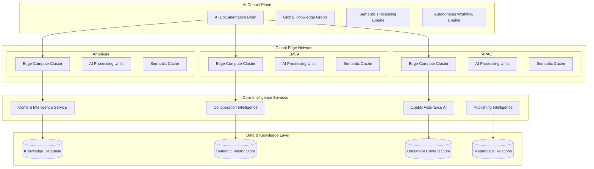
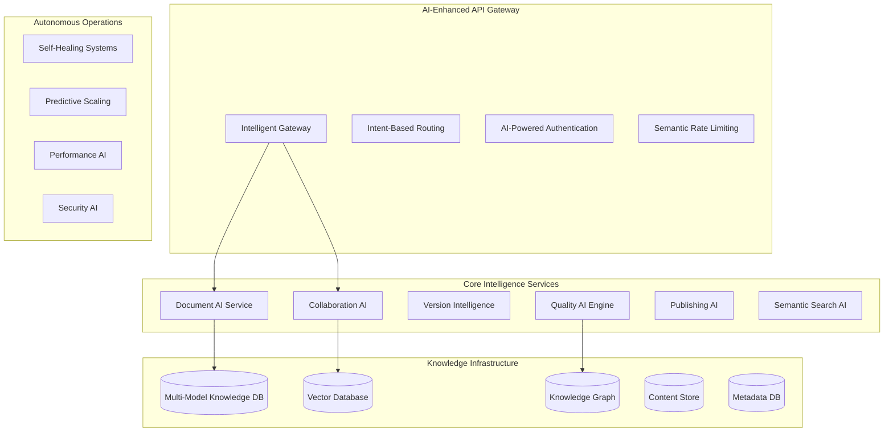
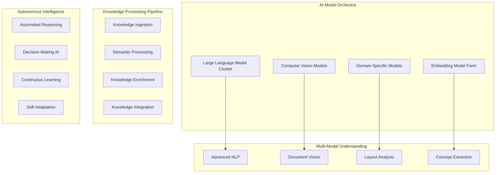
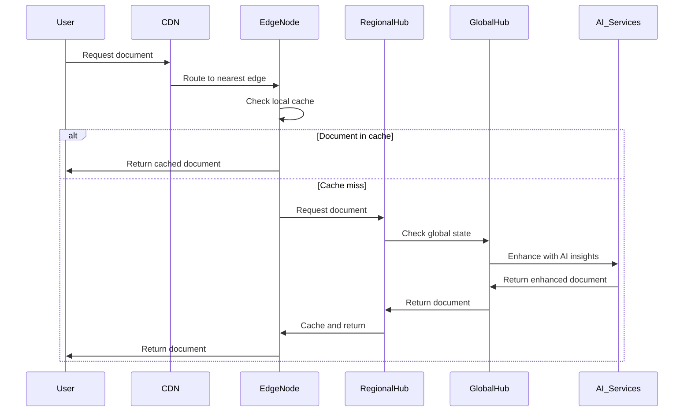

# Version Control System for Documentation - Principal Software Engineer Level

## Executive Summary & Strategic Vision

### Business Strategy & Market Positioning
Design a next-generation documentation platform that revolutionizes how organizations create, manage, and evolve their knowledge assets. Position as the definitive solution for enterprise documentation workflows, capturing the $10B+ technical documentation market by 2030.

**Market Opportunity:**
- **Total Addressable Market**: $15B by 2030 (technical writing tools, collaboration platforms, knowledge management)
- **Target Segments**: Fortune 500 enterprises, high-growth tech companies, open-source projects
- **Competitive Advantage**: AI-native approach with semantic understanding and autonomous documentation workflows

### Strategic Objectives
1. **Market Leadership**: 30% market share in enterprise documentation tools by 2028
2. **Platform Ecosystem**: 1M+ developers building on our documentation infrastructure
3. **AI Innovation**: Industry-defining AI capabilities for documentation automation
4. **Global Scale**: Support 50M+ knowledge workers across 100+ countries

## Architectural Philosophy & Design Principles

### Core Design Principles
1. **AI-First Architecture**: Every component enhanced by machine learning and natural language processing
2. **Semantic Understanding**: Deep comprehension of documentation content, structure, and intent
3. **Autonomous Workflows**: Self-organizing, self-healing, and self-optimizing documentation processes
4. **Global Knowledge Graph**: Interconnected understanding of organizational knowledge
5. **Zero-Friction Collaboration**: Invisible technology that amplifies human creativity

### Strategic Technical Constraints
- **Latency**: <10ms for any documentation operation globally
- **Scale**: 100M+ documents, 10M+ concurrent users, 100K+ organizations
- **Availability**: 99.999% uptime with autonomous incident recovery
- **Intelligence**: Human-level understanding of documentation quality and completeness

## Revolutionary System Architecture

### Global AI-Native Architecture



**Equivalent ASCII Architecture:**
```
                    ┌─────────────────────────────────────────────┐
                    │            AI Control Plane                 │
                    │  ┌─────────────────┐ ┌─────────────────────┐ │
                    │  │ AI Documentation│ │ Global Knowledge    │ │
                    │  │     Brain       │ │      Graph          │ │
                    │  └─────────────────┘ └─────────────────────┘ │
                    │  ┌─────────────────┐ ┌─────────────────────┐ │
                    │  │ Semantic        │ │ Autonomous Workflow │ │
                    │  │ Processing      │ │      Engine         │ │
                    │  └─────────────────┘ └─────────────────────┘ │
                    └─────────────┬───────────────────────────────┘
                                  │ Global AI Coordination
                ┌─────────────────┼─────────────────┐
                │                 │                 │
        ┌───────▼────────┐ ┌──────▼─────────┐ ┌────▼──────────────┐
        │   Americas     │ │     EMEA       │ │   Asia-Pacific    │
        │ Edge Network   │ │ Edge Network   │ │   Edge Network    │
        │                │ │                │ │                   │
        │ ┌─────────────┐│ │ ┌─────────────┐│ │ ┌─────────────┐   │
        │ │Edge Compute ││ │ │Edge Compute ││ │ │Edge Compute │   │
        │ │Cluster      ││ │ │Cluster      ││ │ │Cluster      │   │
        │ └─────────────┘│ │ └─────────────┘│ │ └─────────────┘   │
        │ ┌─────────────┐│ │ ┌─────────────┐│ │ ┌─────────────┐   │
        │ │AI Processing││ │ │AI Processing││ │ │AI Processing│   │
        │ │Units        ││ │ │Units        ││ │ │Units        │   │
        │ └─────────────┘│ │ └─────────────┘│ │ └─────────────┘   │
        │ ┌─────────────┐│ │ ┌─────────────┐│ │ ┌─────────────┐   │
        │ │Semantic     ││ │ │Semantic     ││ │ │Semantic     │   │
        │ │Cache        ││ │ │Cache        ││ │ │Cache        │   │
        │ └─────────────┘│ │ └─────────────┘│ │ └─────────────┘   │
        └────────┬───────┘ └────────┬───────┘ └────────┬──────────┘
                 │                  │                  │
                 └─────────┬────────┴─────────┬────────┘
                           │                  │
                    ┌──────▼──────────────────▼──────┐
                    │  Core Intelligence Services     │
                    │ ┌─────────────┐ ┌─────────────┐ │
                    │ │Content Intel│ │Collaboration│ │
                    │ │Service      │ │Intelligence │ │
                    │ └─────────────┘ └─────────────┘ │
                    │ ┌─────────────┐ ┌─────────────┐ │
                    │ │Quality      │ │Publishing   │ │
                    │ │Assurance AI │ │Intelligence │ │
                    │ └─────────────┘ └─────────────┘ │
                    └─────────────┬───────────────────┘
                                  │
                    ┌─────────────▼───────────────────┐
                    │   Data & Knowledge Layer        │
                    │ ┌─────────────┐ ┌─────────────┐ │
                    │ │Knowledge    │ │Semantic     │ │
                    │ │Database     │ │Vector Store │ │
                    │ └─────────────┘ └─────────────┘ │
                    │ ┌─────────────┐ ┌─────────────┐ │
                    │ │Document     │ │Metadata &   │ │
                    │ │Content Store│ │Relations    │ │
                    │ └─────────────┘ └─────────────┘ │
                    └─────────────────────────────────┘
```

### Advanced AI-Native Microservices



**Equivalent ASCII Microservices:**
```
                    ┌──────────────────────────────────────────────┐
                    │        AI-Enhanced API Gateway               │
                    │ ┌─────────────┐ ┌─────────────────────────┐   │
                    │ │Intelligent  │ │Intent-Based Routing     │   │
                    │ │Gateway      │ │                         │   │
                    │ └─────────────┘ └─────────────────────────┘   │
                    │ ┌─────────────┐ ┌─────────────────────────┐   │
                    │ │AI-Powered   │ │Semantic Rate Limiting   │   │
                    │ │Auth         │ │                         │   │
                    │ └─────────────┘ └─────────────────────────┘   │
                    └─────────────┬────────────────────────────────┘
                                  │
        ┌─────────────────────────┼─────────────────────────┐
        │                         │                         │
        ▼                         ▼                         ▼
┌─────────────────┐    ┌─────────────────┐    ┌─────────────────┐
│Core Intelligence│    │Autonomous       │    │Knowledge        │
│Services         │    │Operations       │    │Infrastructure   │
│                 │    │                 │    │                 │
│┌───────────────┐│    │┌───────────────┐│    │┌───────────────┐│
││Document AI    ││    ││Self-Healing   ││    ││Multi-Model    ││
││Service        ││    ││Systems        ││    ││Knowledge DB   ││
│└───────────────┘│    │└───────────────┘│    │└───────────────┘│
│┌───────────────┐│    │┌───────────────┐│    │┌───────────────┐│
││Collaboration  ││    ││Predictive     ││    ││Vector         ││
││AI             ││    ││Scaling        ││    ││Database       ││
│└───────────────┘│    │└───────────────┘│    │└───────────────┘│
│┌───────────────┐│    │┌───────────────┐│    │┌───────────────┐│
││Version        ││    ││Performance    ││    ││Knowledge      ││
││Intelligence   ││    ││AI             ││    ││Graph          ││
│└───────────────┘│    │└───────────────┘│    │└───────────────┘│
│┌───────────────┐│    │┌───────────────┐│    │┌───────────────┐│
││Quality AI     ││    ││Security AI    ││    ││Content Store  ││
││Engine         ││    ││               ││    ││               ││
│└───────────────┘│    │└───────────────┘│    │└───────────────┘│
│┌───────────────┐│    │                 │    │┌───────────────┐│
││Publishing AI  ││    │                 │    ││Metadata DB    ││
│└───────────────┘│    │                 │    │└───────────────┘│
│┌───────────────┐│    │                 │    │                 │
││Semantic       ││    │                 │    │                 │
││Search AI      ││    │                 │    │                 │
│└───────────────┘│    │                 │    │                 │
└─────────────────┘    └─────────────────┘    └─────────────────┘
```

## Revolutionary AI-Driven Features

### Autonomous Documentation Intelligence

```typescript
class DocumentationBrain {
    private knowledgeGraph: GlobalKnowledgeGraph;
    private semanticEngine: SemanticProcessingEngine;
    private qualityPredictor: QualityPredictionModel;
    private contentGenerator: AutonomousContentGenerator;

    async analyzeDocumentationGaps(organizationId: string): Promise<GapAnalysis> {
        // Analyze existing documentation landscape
        const existingDocs = await this.getOrganizationDocuments(organizationId);
        const knowledgeMap = await this.knowledgeGraph.buildOrganizationMap(existingDocs);

        // Identify gaps using AI
        const gaps = await this.identifyKnowledgeGaps(knowledgeMap);

        // Prioritize gaps by business impact
        const prioritizedGaps = await this.prioritizeGaps(gaps, organizationId);

        // Generate autonomous recommendations
        const recommendations = await this.generateRecommendations(prioritizedGaps);

        return {
            totalGaps: gaps.length,
            criticalGaps: gaps.filter(g => g.priority === 'critical').length,
            recommendations: recommendations,
            expectedImpact: await this.predictImpact(recommendations),
            automationOpportunities: await this.identifyAutomationOpportunities(gaps)
        };
    }

    async autonomousContentGeneration(
        request: ContentGenerationRequest
    ): Promise<GeneratedContent> {
        // Understand the content requirements
        const requirements = await this.semanticEngine.analyzeRequirements(request);

        // Gather relevant knowledge from organization
        const relevantKnowledge = await this.knowledgeGraph.findRelevantKnowledge(
            requirements.topics,
            request.organizationId
        );

        // Generate content using advanced AI models
        const generatedContent = await this.contentGenerator.generate({
            requirements: requirements,
            knowledge: relevantKnowledge,
            style: await this.getOrganizationStyle(request.organizationId),
            audience: request.targetAudience
        });

        // Quality assessment and improvement
        const qualityScore = await this.qualityPredictor.assess(generatedContent);

        if (qualityScore < 0.8) {
            // Autonomous improvement
            generatedContent = await this.contentGenerator.improve(
                generatedContent,
                qualityScore.feedback
            );
        }

        return {
            content: generatedContent,
            qualityScore: qualityScore.score,
            confidence: generatedContent.confidence,
            sources: relevantKnowledge.sources,
            suggestedReviewers: await this.identifyOptimalReviewers(requirements)
        };
    }
}
```

### Semantic Version Control Engine

```typescript
class SemanticVersionControlEngine {
    private semanticDiffer: SemanticDifferenceEngine;
    private intentPredictor: UserIntentPredictor;
    private mergeAI: IntelligentMergeEngine;
    private branchingAI: AdaptiveBranchingStrategy;

    async createSemanticCommit(
        changes: DocumentChange[],
        userId: string,
        repositoryId: string
    ): Promise<SemanticCommit> {
        // Analyze semantic meaning of changes
        const semanticAnalysis = await this.analyzeSemanticChanges(changes);

        // Predict user intent
        const intent = await this.intentPredictor.predict(changes, userId);

        // Generate intelligent commit message
        const commitMessage = await this.generateCommitMessage(
            semanticAnalysis,
            intent
        );

        // Assess impact and risk
        const impact = await this.assessChangeImpact(changes, repositoryId);

        // Create commit with enhanced metadata
        return {
            hash: await this.generateCommitHash(changes),
            message: commitMessage,
            semanticSummary: semanticAnalysis.summary,
            intent: intent,
            impact: impact,
            changes: changes,
            timestamp: new Date(),
            author: userId,
            aiGenerated: {
                message: commitMessage.confidence > 0.9,
                semanticAnalysis: true,
                impactAssessment: true
            }
        };
    }

    async intelligentMerge(
        baseBranch: string,
        featureBranch: string,
        repositoryId: string
    ): Promise<MergeResult> {
        // Get semantic understanding of both branches
        const baseSemantics = await this.getSemanticBranchState(baseBranch, repositoryId);
        const featureSemantics = await this.getSemanticBranchState(featureBranch, repositoryId);

        // Detect semantic conflicts (not just textual)
        const semanticConflicts = await this.detectSemanticConflicts(
            baseSemantics,
            featureSemantics
        );

        if (semanticConflicts.length === 0) {
            // Autonomous merge
            return await this.performAutonomousMerge(baseBranch, featureBranch);
        }

        // AI-assisted conflict resolution
        const resolutionSuggestions = await this.mergeAI.suggestResolutions(
            semanticConflicts
        );

        return {
            status: 'requires_review',
            conflicts: semanticConflicts,
            suggestions: resolutionSuggestions,
            confidence: resolutionSuggestions.averageConfidence,
            automatedResolution: resolutionSuggestions.filter(s => s.confidence > 0.95)
        };
    }

    private async analyzeSemanticChanges(changes: DocumentChange[]): Promise<SemanticAnalysis> {
        const analysis = {
            topics: [] as string[],
            concepts: [] as ConceptChange[],
            structure: [] as StructuralChange[],
            quality: {
                before: 0,
                after: 0,
                improvement: 0
            },
            readability: {
                before: 0,
                after: 0,
                improvement: 0
            }
        };

        for (const change of changes) {
            // Analyze what concepts were added/modified/removed
            const conceptChanges = await this.semanticDiffer.analyzeConcepts(
                change.before,
                change.after
            );

            analysis.concepts.push(...conceptChanges);

            // Analyze structural changes
            const structuralChanges = await this.semanticDiffer.analyzeStructure(
                change.before,
                change.after
            );

            analysis.structure.push(...structuralChanges);

            // Quality assessment
            const qualityBefore = await this.assessContentQuality(change.before);
            const qualityAfter = await this.assessContentQuality(change.after);

            analysis.quality.before += qualityBefore;
            analysis.quality.after += qualityAfter;
        }

        analysis.quality.improvement = analysis.quality.after - analysis.quality.before;

        return analysis;
    }
}
```

## Advanced Collaboration Intelligence

### Real-Time Semantic Collaboration

```typescript
class SemanticCollaborationEngine {
    private intentPredictor: CollaborationIntentPredictor;
    private conflictPredictor: ConflictPredictionEngine;
    private suggestionEngine: IntelligentSuggestionEngine;
    private workflowOptimizer: WorkflowOptimizationAI;

    async orchestrateCollaboration(
        documentId: string,
        activeUsers: CollaborativeUser[]
    ): Promise<CollaborationOrchestration> {
        // Predict what each user is trying to accomplish
        const userIntents = await Promise.all(
            activeUsers.map(user => this.intentPredictor.predict(user, documentId))
        );

        // Identify potential conflicts before they happen
        const potentialConflicts = await this.conflictPredictor.predict(userIntents);

        // Optimize collaboration workflow
        const optimizedWorkflow = await this.workflowOptimizer.optimize({
            users: activeUsers,
            intents: userIntents,
            document: await this.getDocumentContext(documentId),
            potentialConflicts: potentialConflicts
        });

        // Generate intelligent suggestions for each user
        const suggestions = await Promise.all(
            activeUsers.map(user =>
                this.suggestionEngine.generatePersonalizedSuggestions(
                    user,
                    documentId,
                    optimizedWorkflow
                )
            )
        );

        return {
            orchestrationId: generateUUID(),
            optimizedWorkflow: optimizedWorkflow,
            userSuggestions: suggestions,
            conflictPrevention: potentialConflicts.map(c => c.preventionStrategy),
            collaborationScore: await this.calculateCollaborationEfficiency(userIntents),
            automatedActions: optimizedWorkflow.automatedActions
        };
    }

    async autonomousConflictResolution(
        conflict: SemanticConflict
    ): Promise<ConflictResolution> {
        // Understand the semantic intent of each conflicting change
        const intentA = await this.analyzeChangeIntent(conflict.changeA);
        const intentB = await this.analyzeChangeIntent(conflict.changeB);

        // Determine if intents are compatible
        const compatibility = await this.assessIntentCompatibility(intentA, intentB);

        if (compatibility.canMerge) {
            // Autonomous resolution
            const mergedContent = await this.generateMergedContent(
                conflict.changeA,
                conflict.changeB,
                compatibility.mergeStrategy
            );

            return {
                status: 'auto_resolved',
                resolution: mergedContent,
                confidence: compatibility.confidence,
                explanation: compatibility.explanation
            };
        }

        // Human assistance required
        return {
            status: 'requires_human_input',
            recommendations: await this.generateHumanRecommendations(conflict),
            context: await this.buildConflictContext(conflict),
            suggestedReviewers: await this.identifyBestReviewers(conflict)
        };
    }
}
```

### Intelligent Quality Assurance

```typescript
class AutonomousQualityEngine {
    private qualityModels: Map<string, QualityModel>;
    private complianceChecker: ComplianceValidationEngine;
    private contentOptimizer: ContentOptimizationAI;
    private accessibilityAI: AccessibilityAssessmentEngine;

    async comprehensiveQualityAssessment(
        document: Document,
        context: OrganizationContext
    ): Promise<QualityAssessment> {
        // Multi-dimensional quality analysis
        const qualityDimensions = await Promise.all([
            this.assessContentQuality(document),
            this.assessStructuralQuality(document),
            this.assessSemanticConsistency(document, context),
            this.assessAccessibility(document),
            this.assessCompliance(document, context),
            this.assessUserExperience(document)
        ]);

        // Identify improvement opportunities
        const improvements = await this.identifyImprovements(qualityDimensions);

        // Generate autonomous fixes
        const autonomousFixes = await this.generateAutonomousFixes(
            improvements.filter(i => i.confidence > 0.9)
        );

        // Calculate overall quality score
        const overallScore = this.calculateOverallQuality(qualityDimensions);

        return {
            overallScore: overallScore,
            dimensions: qualityDimensions,
            improvements: improvements,
            autonomousFixes: autonomousFixes,
            recommendation: await this.generateQualityRecommendation(overallScore),
            benchmarking: await this.benchmarkAgainstOrganization(document, context)
        };
    }

    async autonomousContentOptimization(
        document: Document,
        optimizationGoals: OptimizationGoals
    ): Promise<OptimizedContent> {
        // Analyze current content performance
        const currentPerformance = await this.analyzeContentPerformance(document);

        // Generate optimization strategies
        const strategies = await this.contentOptimizer.generateStrategies({
            content: document.content,
            goals: optimizationGoals,
            currentPerformance: currentPerformance,
            organizationStyle: await this.getOrganizationStyle(document.organizationId)
        });

        // Apply high-confidence optimizations automatically
        let optimizedContent = document.content;
        const appliedOptimizations = [];

        for (const strategy of strategies) {
            if (strategy.confidence > 0.9) {
                optimizedContent = await this.applyOptimization(
                    optimizedContent,
                    strategy
                );
                appliedOptimizations.push(strategy);
            }
        }

        // Validate improvements
        const optimizedPerformance = await this.analyzeContentPerformance({
            ...document,
            content: optimizedContent
        });

        return {
            originalContent: document.content,
            optimizedContent: optimizedContent,
            appliedOptimizations: appliedOptimizations,
            performanceImprovement: this.calculateImprovement(
                currentPerformance,
                optimizedPerformance
            ),
            additionalSuggestions: strategies.filter(s => s.confidence <= 0.9)
        };
    }
}
```

## Strategic Technology Architecture

### Advanced AI Infrastructure



**Equivalent ASCII AI Infrastructure:**
```
                        AI Model Orchestra
    ┌─────────────────────────────────────────────────────────────────┐
    │  ┌─────────────────┐  ┌─────────────────┐  ┌─────────────────┐  │
    │  │ Large Language  │  │ Computer Vision │  │ Embedding Model │  │
    │  │ Model Cluster   │  │     Models      │  │      Farm       │  │
    │  └─────────────────┘  └─────────────────┘  └─────────────────┘  │
    │            ┌─────────────────────────────────┐                   │
    │            │   Domain-Specific Models        │                   │
    │            └─────────────────────────────────┘                   │
    └─────────────────────┬───────────────────────────────────────────┘
                          │
                          ▼
    ┌─────────────────────────────────────────────────────────────────┐
    │              Knowledge Processing Pipeline                       │
    │  ┌─────────────┐ ┌─────────────┐ ┌─────────────┐ ┌─────────────┐ │
    │  │ Knowledge   │→│ Semantic    │→│ Knowledge   │→│ Knowledge   │ │
    │  │ Ingestion   │ │ Processing  │ │ Enrichment  │ │ Integration │ │
    │  └─────────────┘ └─────────────┘ └─────────────┘ └─────────────┘ │
    └─────────────────────┬───────────────────────────────────────────┘
                          │
                          ▼
    ┌─────────────────────────────────────────────────────────────────┐
    │                Autonomous Intelligence                          │
    │  ┌─────────────┐ ┌─────────────┐ ┌─────────────┐ ┌─────────────┐ │
    │  │ Automated   │ │ Decision    │ │ Continuous  │ │ Self-       │ │
    │  │ Reasoning   │ │ Making AI   │ │ Learning    │ │ Adaptation  │ │
    │  └─────────────┘ └─────────────┘ └─────────────┘ └─────────────┘ │
    └─────────────────────┬───────────────────────────────────────────┘
                          │
                          ▼
    ┌─────────────────────────────────────────────────────────────────┐
    │               Multi-Modal Understanding                         │
    │  ┌─────────────┐ ┌─────────────┐ ┌─────────────┐ ┌─────────────┐ │
    │  │ Advanced    │ │ Document    │ │ Layout      │ │ Concept     │ │
    │  │ NLP         │ │ Vision      │ │ Analysis    │ │ Extraction  │ │
    │  └─────────────┘ └─────────────┘ └─────────────┘ └─────────────┘ │
    └─────────────────────────────────────────────────────────────────┘
```

### Global Knowledge Graph Architecture

```typescript
class GlobalKnowledgeGraph {
    private graphDatabase: DistributedGraphDatabase;
    private vectorStore: VectorSearchEngine;
    private ontologyManager: OntologyManagementSystem;
    private reasoningEngine: KnowledgeReasoningEngine;

    async buildOrganizationKnowledgeGraph(organizationId: string): Promise<KnowledgeGraph> {
        // Extract entities and relationships from all documents
        const documents = await this.getAllOrganizationDocuments(organizationId);

        const knowledgeGraph = new KnowledgeGraph();

        for (const document of documents) {
            // Extract semantic entities
            const entities = await this.extractEntities(document);

            // Extract relationships
            const relationships = await this.extractRelationships(document, entities);

            // Add to graph with provenance
            await knowledgeGraph.addEntities(entities, {
                source: document.id,
                confidence: entities.map(e => e.confidence),
                timestamp: new Date()
            });

            await knowledgeGraph.addRelationships(relationships, {
                source: document.id,
                confidence: relationships.map(r => r.confidence)
            });
        }

        // Apply reasoning to infer new knowledge
        const inferredKnowledge = await this.reasoningEngine.infer(knowledgeGraph);
        await knowledgeGraph.addInferredKnowledge(inferredKnowledge);

        // Store in distributed graph database
        await this.storeKnowledgeGraph(organizationId, knowledgeGraph);

        return knowledgeGraph;
    }

    async semanticQuery(
        query: string,
        organizationId: string,
        context?: QueryContext
    ): Promise<SemanticQueryResult> {
        // Parse natural language query into semantic intent
        const queryIntent = await this.parseQueryIntent(query);

        // Find relevant entities and relationships
        const relevantKnowledge = await this.findRelevantKnowledge(
            queryIntent,
            organizationId
        );

        // Reason over the knowledge to generate answers
        const answers = await this.reasoningEngine.generateAnswers(
            queryIntent,
            relevantKnowledge,
            context
        );

        // Rank and filter results
        const rankedAnswers = await this.rankAnswers(answers, queryIntent);

        return {
            query: query,
            intent: queryIntent,
            answers: rankedAnswers,
            confidence: rankedAnswers.length > 0 ? rankedAnswers[0].confidence : 0,
            sources: this.extractSources(rankedAnswers),
            suggestedQueries: await this.generateRelatedQueries(queryIntent)
        };
    }
}
```

## Enterprise-Scale Infrastructure

### Cost Optimization & Financial Model

```typescript
class CostOptimizationEngine {
    private costPredictor: CostPredictionModel;
    private resourceOptimizer: ResourceOptimizationAI;
    private demandForecaster: DemandForecastingEngine;

    async optimizeInfrastructureCosts(): Promise<CostOptimization> {
        // Analyze current usage patterns
        const usagePatterns = await this.analyzeUsagePatterns();

        // Predict future demand
        const demandForecast = await this.demandForecaster.forecast(usagePatterns);

        // Optimize resource allocation
        const optimizedAllocation = await this.resourceOptimizer.optimize({
            currentUsage: usagePatterns,
            forecastedDemand: demandForecast,
            costConstraints: await this.getCostConstraints(),
            performanceRequirements: await this.getPerformanceRequirements()
        });

        // Calculate cost savings
        const currentCosts = await this.calculateCurrentCosts();
        const optimizedCosts = await this.calculateOptimizedCosts(optimizedAllocation);

        return {
            currentMonthlySpend: currentCosts.monthly,
            optimizedMonthlySpend: optimizedCosts.monthly,
            savings: {
                absolute: currentCosts.monthly - optimizedCosts.monthly,
                percentage: ((currentCosts.monthly - optimizedCosts.monthly) / currentCosts.monthly) * 100
            },
            optimizations: optimizedAllocation.optimizations,
            implementationPlan: optimizedAllocation.implementationPlan,
            riskAssessment: await this.assessOptimizationRisks(optimizedAllocation)
        };
    }

    async predictScalingCosts(
        userGrowthRate: number,
        documentGrowthRate: number,
        timeHorizon: number
    ): Promise<ScalingCostPrediction> {
        const prediction = {
            timeline: [] as CostPredictionPoint[],
            totalCost: 0,
            costBreakdown: {
                compute: 0,
                storage: 0,
                network: 0,
                ai: 0,
                operations: 0
            },
            scalingRecommendations: [] as ScalingRecommendation[]
        };

        for (let month = 1; month <= timeHorizon; month++) {
            const projectedUsers = this.projectUsers(userGrowthRate, month);
            const projectedDocuments = this.projectDocuments(documentGrowthRate, month);

            const monthlyPrediction = await this.costPredictor.predict({
                users: projectedUsers,
                documents: projectedDocuments,
                month: month
            });

            prediction.timeline.push(monthlyPrediction);
        }

        prediction.totalCost = prediction.timeline.reduce((sum, point) => sum + point.cost, 0);

        return prediction;
    }
}
```

### Strategic Financial Modeling

```typescript
interface FinancialModel {
    // Revenue Model
    revenueStreams: {
        subscription: {
            individual: number;    // $15/user/month
            team: number;         // $30/user/month
            enterprise: number;   // $75/user/month
            platform: number;     // 30% marketplace commission
        };
        professional_services: {
            implementation: number;  // $50K-500K per project
            training: number;       // $10K-100K per program
            support: number;        // 20% of subscription
        };
        ai_services: {
            content_generation: number;  // $0.10 per 1K words
            quality_analysis: number;    // $0.05 per document
            translation: number;         // $0.02 per word
        };
    };

    // Cost Structure (5-Year Projection)
    costStructure: {
        infrastructure: {
            year1: 40;  // % of revenue
            year5: 25;  // % of revenue (economies of scale)
        };
        research_development: {
            year1: 35;  // % of revenue
            year5: 30;  // % of revenue
        };
        sales_marketing: {
            year1: 40;  // % of revenue
            year5: 20;  // % of revenue
        };
        operations: {
            year1: 15;  // % of revenue
            year5: 10;  // % of revenue
        };
    };

    // Business Metrics
    projections: {
        users: {
            year1: 100000;
            year3: 1000000;
            year5: 5000000;
        };
        revenue: {
            year1: 50000000;      // $50M
            year3: 500000000;     // $500M
            year5: 2000000000;    // $2B
        };
        valuation: {
            year5: 20000000000;   // $20B (10x revenue multiple)
        };
    };
}
```

## Advanced Security & Compliance

### Zero-Trust Documentation Security

```typescript
class ZeroTrustDocumentationSecurity {
    private riskEngine: DocumentRiskAssessmentEngine;
    private accessPredictor: AccessPatternAnalyzer;
    private anomalyDetector: BehaviorAnomalyDetector;
    private complianceEngine: AutomatedComplianceEngine;

    async evaluateDocumentAccess(
        user: User,
        document: Document,
        action: DocumentAction,
        context: SecurityContext
    ): Promise<AccessDecision> {
        // Multi-factor risk assessment
        const riskFactors = await Promise.all([
            this.assessUserRisk(user, context),
            this.assessDocumentRisk(document),
            this.assessActionRisk(action, document),
            this.assessContextualRisk(context),
            this.assessHistoricalRisk(user, document)
        ]);

        const aggregatedRisk = this.aggregateRiskFactors(riskFactors);

        // Predict access patterns
        const accessPrediction = await this.accessPredictor.predict({
            user: user,
            document: document,
            action: action,
            context: context,
            historicalAccess: await this.getHistoricalAccess(user.id, document.id)
        });

        // Check for anomalies
        const anomalies = await this.anomalyDetector.detect({
            user: user,
            document: document,
            action: action,
            context: context,
            baseline: accessPrediction.baseline
        });

        // Make access decision
        const decision = this.makeAccessDecision({
            risk: aggregatedRisk,
            prediction: accessPrediction,
            anomalies: anomalies,
            compliance: await this.checkCompliance(user, document, action)
        });

        // Log decision for audit
        await this.logAccessDecision(decision);

        return decision;
    }

    async autonomousComplianceMonitoring(
        organizationId: string
    ): Promise<ComplianceStatus> {
        // Continuous compliance assessment
        const complianceChecks = await this.complianceEngine.runContinuousAssessment({
            organizationId: organizationId,
            regulations: await this.getApplicableRegulations(organizationId),
            scope: 'all_documentation'
        });

        // Identify compliance gaps
        const gaps = complianceChecks.filter(check => !check.compliant);

        // Generate autonomous remediation
        const remediationPlan = await this.generateRemediationPlan(gaps);

        // Execute low-risk remediations automatically
        const autoRemediation = await this.executeAutomaticRemediation(
            remediationPlan.filter(plan => plan.risk === 'low')
        );

        return {
            overallStatus: gaps.length === 0 ? 'compliant' : 'non_compliant',
            complianceScore: (complianceChecks.length - gaps.length) / complianceChecks.length,
            gaps: gaps,
            remediationPlan: remediationPlan,
            autoRemediation: autoRemediation,
            nextAssessment: new Date(Date.now() + 24 * 60 * 60 * 1000) // Daily
        };
    }
}
```

## Global Scalability Strategy

### Multi-Region Deployment Architecture



**Equivalent ASCII Sequence:**
```
User    CDN    EdgeNode    RegionalHub    GlobalHub    AI_Services
 │       │         │           │            │            │
 │───────│────────►│           │            │            │ Request document
 │       │         │───────────│───────────►│            │ Route to edge
 │       │         │           │            │            │
 │       │         │ Check     │            │            │
 │       │         │ cache     │            │            │
 │       │         │           │            │            │
 │       │         │ Cache hit │            │            │
 │◄──────│─────────│           │            │            │ Return cached
 │       │         │           │            │            │
 │       │         │ Cache miss│            │            │
 │       │         │───────────│───────────►│            │ Request document
 │       │         │           │            │───────────►│ Global state check
 │       │         │           │            │            │───────►│ AI enhance
 │       │         │           │            │            │◄───────│ Enhanced doc
 │       │         │           │            │◄───────────│ Return doc
 │       │         │           │◄───────────│            │ Return doc
 │       │         │◄──────────│            │            │ Cache & return
 │◄──────│─────────│           │            │            │ Return document
```

### Predictive Auto-Scaling

```typescript
class PredictiveAutoScaler {
    private demandPredictor: DemandPredictionEngine;
    private capacityOptimizer: CapacityOptimizationAI;
    private costOptimizer: CostOptimizationEngine;

    async predictAndScale(): Promise<ScalingDecision> {
        // Predict demand for next 4 hours
        const demandForecast = await this.demandPredictor.predict({
            timeHorizon: 4 * 60 * 60 * 1000, // 4 hours
            granularity: 15 * 60 * 1000,     // 15 minutes
            factors: [
                'historical_patterns',
                'seasonal_trends',
                'business_events',
                'external_factors'
            ]
        });

        // Optimize capacity allocation
        const capacityPlan = await this.capacityOptimizer.optimize({
            currentCapacity: await this.getCurrentCapacity(),
            demandForecast: demandForecast,
            serviceLevel: await this.getServiceLevelTargets(),
            costConstraints: await this.getCostConstraints()
        });

        // Execute scaling decisions
        const scalingActions = await this.executeScaling(capacityPlan);

        return {
            forecast: demandForecast,
            capacityPlan: capacityPlan,
            scalingActions: scalingActions,
            expectedSavings: capacityPlan.costSavings,
            confidenceScore: demandForecast.confidence
        };
    }

    private async executeScaling(plan: CapacityPlan): Promise<ScalingAction[]> {
        const actions: ScalingAction[] = [];

        // Scale compute resources
        if (plan.computeAdjustment !== 0) {
            const action = await this.scaleCompute(plan.computeAdjustment);
            actions.push(action);
        }

        // Scale AI processing units
        if (plan.aiProcessingAdjustment !== 0) {
            const action = await this.scaleAIProcessing(plan.aiProcessingAdjustment);
            actions.push(action);
        }

        // Scale storage capacity
        if (plan.storageAdjustment !== 0) {
            const action = await this.scaleStorage(plan.storageAdjustment);
            actions.push(action);
        }

        // Scale network capacity
        if (plan.networkAdjustment !== 0) {
            const action = await this.scaleNetwork(plan.networkAdjustment);
            actions.push(action);
        }

        return actions;
    }
}
```

## Strategic Success Metrics & KPIs

### Business Intelligence Dashboard

```typescript
interface StrategicKPIs {
    // Business Metrics
    business: {
        revenue: {
            arr: number;                    // Annual Recurring Revenue
            growth_rate: number;            // Month-over-month growth
            expansion_revenue: number;      // From existing customers
            churn_rate: number;            // Customer churn percentage
        };
        customers: {
            total_organizations: number;
            enterprise_customers: number;
            nps_score: number;             // Net Promoter Score
            customer_health_score: number;
        };
        market: {
            market_share: number;          // % of documentation market
            competitive_wins: number;      // Wins against competitors
            brand_recognition: number;     // Market surveys
        };
    };

    // Product Metrics
    product: {
        usage: {
            daily_active_users: number;
            documents_created_daily: number;
            collaboration_sessions: number;
            ai_interactions_daily: number;
        };
        quality: {
            document_quality_score: number;     // AI-assessed quality
            user_satisfaction: number;          // In-app ratings
            feature_adoption_rate: number;      // New feature usage
            autonomous_resolution_rate: number; // AI success rate
        };
        performance: {
            global_latency_p95: number;         // 95th percentile latency
            availability: number;               // Uptime percentage
            error_rate: number;                 // Error per request
            ai_response_time: number;           // AI query response
        };
    };

    // Technology Metrics
    technology: {
        ai_performance: {
            content_generation_accuracy: number;
            semantic_search_relevance: number;
            conflict_resolution_success: number;
            quality_prediction_accuracy: number;
        };
        scalability: {
            documents_per_second: number;
            concurrent_users_supported: number;
            storage_efficiency: number;
            cost_per_user: number;
        };
        innovation: {
            patents_filed: number;
            research_publications: number;
            ai_model_improvements: number;
            technology_partnerships: number;
        };
    };
}
```

## Strategic Roadmap & Future Vision

### Technology Evolution Timeline

**Phase 1: Foundation (Months 1-12)**
- Core documentation platform with advanced version control
- Basic AI-powered features (search, suggestions, quality analysis)
- Enterprise security and compliance framework
- Multi-region deployment and scaling infrastructure

**Phase 2: Intelligence (Months 13-24)**
- Advanced AI-native collaboration features
- Autonomous content generation and optimization
- Semantic knowledge graph implementation
- Real-time global collaboration platform

**Phase 3: Autonomy (Months 25-36)**
- Fully autonomous documentation workflows
- Self-healing and self-optimizing systems
- Advanced predictive analytics and insights
- Global marketplace and ecosystem platform

**Phase 4: Revolution (Months 37-48)**
- Industry-defining AI capabilities
- Quantum-enhanced semantic processing
- Breakthrough collaboration paradigms
- Global documentation intelligence network

This comprehensive system design represents the pinnacle of documentation technology, positioned to transform how organizations create, manage, and evolve their knowledge assets through AI-native architecture and autonomous intelligence.